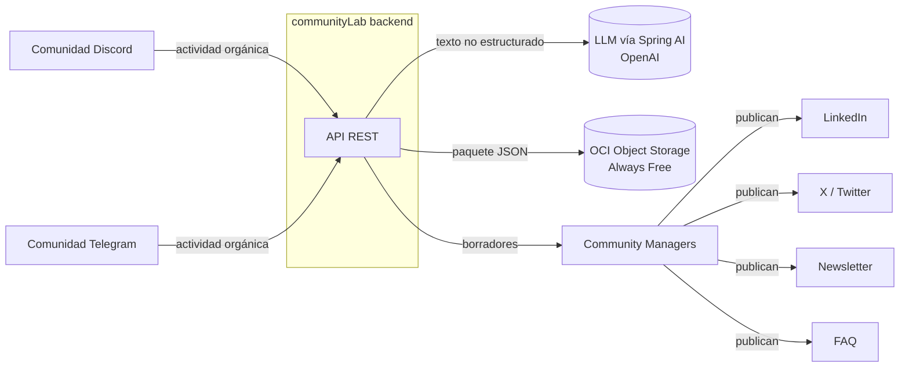
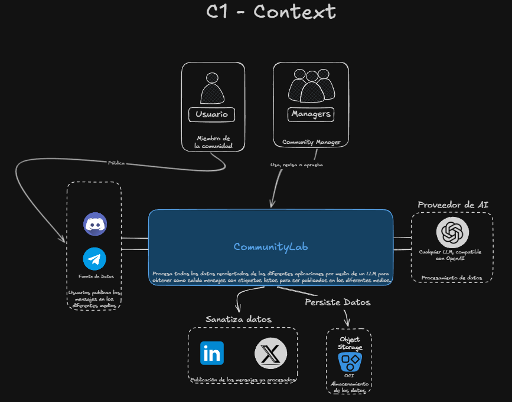

# 03. Contexto y Alcance

> Fuente: specs 001–004 + constitución R8. Estado: **vigente**.

## 3.1 Contexto de negocio (caja negra)

> **Diagrama C1 del equipo** (vista simplificada: Newsletter y FAQ se omiten en el dibujo; el alcance de 4 canales sigue intacto según R8).

| Actor / sistema vecino | Interacción | Dirección |
|---|---|---|
| Comunidades Discord / Telegram | Origen de la actividad (testimonios, logros, dudas). En Fase 1 la app remite cada mensaje por JSON; sin bots ni polling | Entrada |
| LLM externo (OpenAI) | Análisis (sentimiento, temas, relevancia) y redacción multicanal con salida estructurada | Bidireccional |
| OCI Object Storage | Persistencia del `PaqueteDeActivos` (`paquete-{batchId}.json`, `< 1MB`) | Salida |
| Frontend (dashboard público) | Único consumidor de la API en Fase 1. Recibe `202`/`201`, errores tipados (`400/413/429`, fallbacks `207`) y los presenta; seguridad futura en Fase >1 | Bidireccional |
| Community Managers | Consumen borradores y publican manualmente | Salida (humana) |
| Jurado / plataforma ONE | Verifican `/actuator/health` y Swagger | Lectura |

Fuera de alcance Fase 1: publicación automática en redes, bots directos, auth/usuarios (constitución §5).

## 3.2 Contexto técnico

| Interfaz | Protocolo / formato | Notas |
|---|---|---|
| Ingesta `POST /api/v1/ingest` | HTTPS + REST, `application/json`, un mensaje por request | Validación Bean Validation; errores `400/413/429` en formato problema |
| Análisis `POST /api/v1/analyze` | HTTPS + REST, JSON | Timeout 15 s por lote, 1 reintento, fallback sin `500` |
| Generación `POST /api/v1/generate` | HTTPS + REST, JSON | Prompts versionados (`promptVersion` trazable) |
| Orquestación `POST /api/v1/packages:run` | HTTPS + REST, JSON | `201` ok / `207` con fallbacks parciales |
| Eventos `GET /api/v1/events` | HTTPS + SSE (`text/event-stream`) | Tipos `asset.created` / `package.completed`; reconexión por `Last-Event-ID`; mismo CORS que el resto |
| Storage | OCI SDK, objetos `application/json` | Credenciales por entorno, nunca en repo |
| Salud | `GET /actuator/health` (solo `health,info` expuestos) | Sin auth, `p95 < 100ms` |
| Docs API | Swagger UI (`springdoc-openapi`) | Obligatorio por endpoint (P3) |

Seguridad de borde Fase 1: CORS allowlist por env, headers (`nosniff`, `DENY`), CSRF deshabilitado
(API stateless sin cookies), límite 10 MB por request. Sin autenticación por decisión (CT-7).
