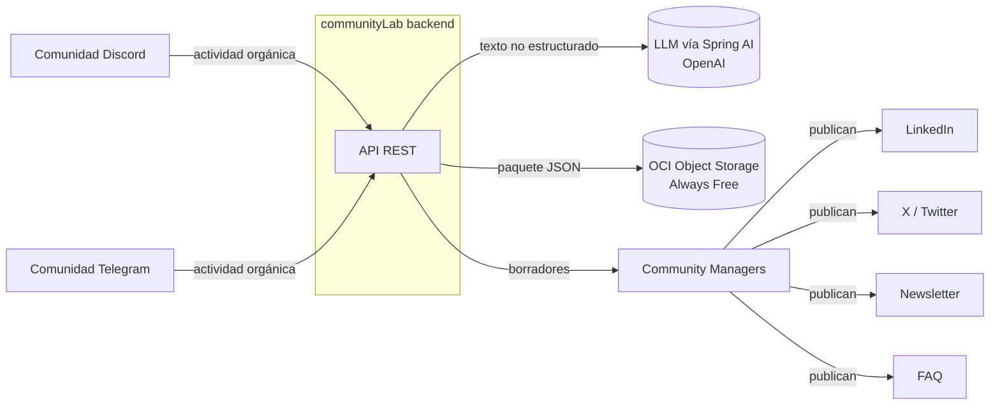
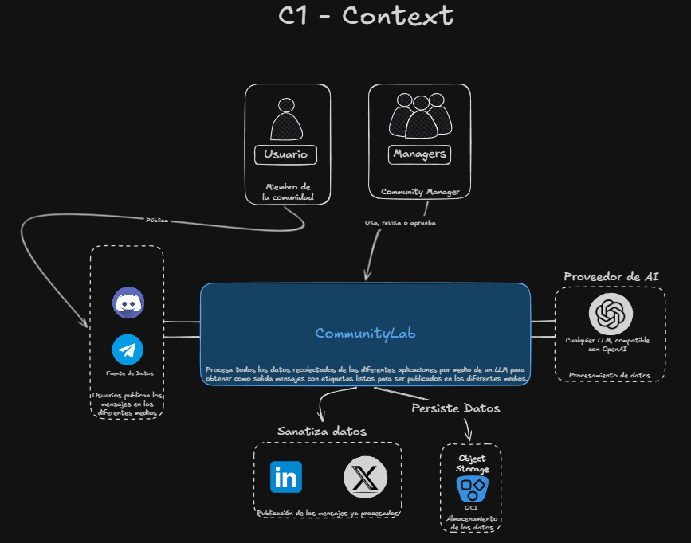

# 03. Contexto y Alcance

> Fuente: specs 001–004 + constitución R8. Estado: **vigente**.

## 3.1 Contexto de negocio (caja negra)

```mermaid
flowchart LR
    D[Comunidad Discord] -->|actividad orgánica| API
    T[Comunidad Telegram] -->|actividad orgánica| API
    subgraph communityLab [communityLab backend]
        API[API REST]
    end
    API -->|texto no estructurado| LLM[(LLM vía Spring AI<br/>OpenAI)]
    API -->|paquete JSON| OCI[(OCI Object Storage<br/>Always Free)]
    API -->|borradores| CM[Community Managers]
    CM -->|publican| LI[LinkedIn]
    CM -->|publican| X[X / Twitter]
    CM -->|publican| NL[Newsletter]
    CM -->|publican| FAQ[FAQ]
```

> **Diagrama C1 del equipo** (vista simplificada: Newsletter y FAQ se omiten en el dibujo; el alcance de 4 canales sigue intacto según R8).

| Actor / sistema vecino | Interacción | Dirección |
|---|---|---|
| Comunidades Discord / Telegram | Discord entra vía bot JDA y Telegram vía bot TelegramBots long polling (el backend es ambos bots). Sin polling REST ni endpoints | Entrada |
| LLM externo (OpenAI) | Análisis (sentimiento, temas, relevancia) y redacción multicanal con salida estructurada | Bidireccional |
| OCI Object Storage | Persistencia del `PaqueteDeActivos` (`paquete-{batchId}.json`, `< 1MB`) | Salida |
| Frontend (dashboard externo) | Único consumidor de la API en Fase 1. Solo recibe el único `GET /api/v1/discord/messages` (SSE vivo); seguridad futura en Fase >1 | Salida (lectura) |
| Community Managers | Consumen borradores y publican manualmente | Salida (humana) |
| Jurado / plataforma ONE | Verifican `/actuator/health` y Swagger | Lectura |

Fuera de alcance Fase 1: publicación automática en redes, webhook Telegram, auth/usuarios (constitución §5). Bots JDA + TelegramBots long polling en alcance (spec 001).

## 3.2 Contexto técnico

| Interfaz | Protocolo / formato | Notas |
|---|---|---|
| Ingesta Discord (bot JDA) | Gateway Discord, eventos `MessageReceivedEvent`, sin endpoint REST | Se ignora `author.isBot`; `type=OTRO`; canal = nombre; >2000 truncado con flag |
| Ingesta Telegram (bot TelegramBots long polling) | Telegram API, `Update`, sin endpoint REST ni URL pública | Se ignora `from.isBot`; `type=OTRO`; chat = nombre; >2000 truncado con flag |
| Análisis y generación | Internos (evento `#Listen` → LLM → assets). Sin endpoint (decisión single-GET 2026-09-28) | — |
| Paquetes y flush OCI | Jobs internos (buffer por bytes → flush automático; newsletter por `@Scheduler`). Sin endpoint | Solo lo persistido sale vía SSE |
| Orquestación manual | Eliminada (sin `:run` ni newsletter manual) | — |
| Eventos `GET /api/v1/discord/messages` | HTTPS + SSE (`text/event-stream`) | Único endpoint de negocio. Tipos `asset.created` / `package.completed` por el mismo stream; reconexión por `Last-Event-ID` (replay en memoria); mismo CORS que el resto |
| Storage | OCI SDK, objetos `application/json` | Credenciales por entorno, nunca en repo |
| Salud | `GET /actuator/health` (solo `health,info` expuestos) | Sin auth, `p95 < 100ms` |
| Docs API | Swagger UI (`springdoc-openapi`) | Obligatorio por endpoint (P3) |

Seguridad de borde Fase 1: CORS allowlist por env (solo `GET,OPTIONS`, sin credenciales),
headers (`nosniff`, `DENY`), CSRF deshabilitado (API stateless sin cookies), límite 10 MB reservado
a 004. Sin autenticación por decisión (CT-7). Sin endpoint de ingesta: el único tráfico de
entrada son los bots; la API solo expone GETs.
