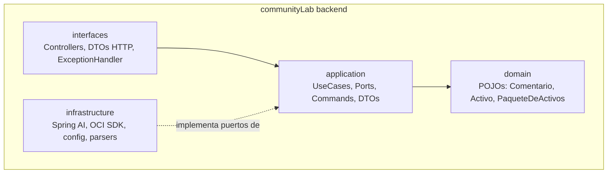

# 05. Vista de Bloques de Construcción

## Nivel 1 (previsto, según constitución R1)

Interfaces: HTTP/JSON (vía `interfaces`), puertos `AnalyzePort`, `GeneratePort`, `ArtifactStorePort`
(vía `application`), SDKs externos (vía `infrastructure`).

## Vista de contenedores

Notas de lectura: el "Frontend" es el dashboard público, único consumidor de la API en Fase 1;
"Admin Panel" es solo nombre, sin roles (CT-7). La flecha HTTPS con el proveedor de IA se lee
Backend→Proveedor (el backend invoca al LLM). La "suscripción persistente" Backend→Frontend es el
stream SSE `GET /api/v1/events` (ver §06, secuencia 5).

## Nivel 2 (pendiente)

> [!TODO] Descomponer por spec al implementar: 001 (`IngestController`, `IngestUseCase`, adaptadores por
> fuente `DiscordAdapter`/`TelegramAdapter` que normalizan el JSON de cada app a `Comentario`),
> 002 (`AnalyzeUseCase`, `SpringAiAnalyzeAdapter`, `RelevancePolicy`), 003 (`GenerateUseCase`,
> `ChannelPolicy`, `HallucinationGuard`), 004 (`PackageRunUseCase`, `OciObjectStorageAdapter`).
> Nivel 3 solo si un componente lo justifica.
