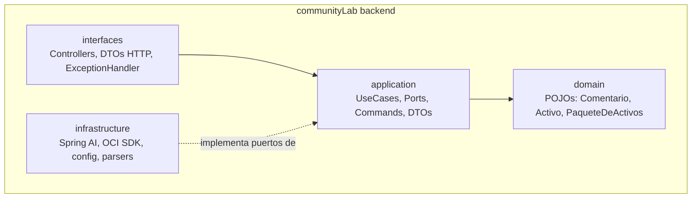

# 05. Vista de Bloques de Construcción

## Nivel 1 (previsto, según constitución R1)

```mermaid
flowchart TB
    subgraph APP [communityLab backend]
        IF[interfaces<br/>Controllers, DTOs HTTP, ExceptionHandler]
        AP[application<br/>UseCases, Ports, Commands, DTOs]
        DM[domain<br/>POJOs: Comentario, Activo, PaqueteDeActivos]
        IN[infrastructure<br/>Spring AI, OCI SDK, config, parsers]
    end
    IF --> AP --> DM
    IN -.implementa puertos de.-> AP
```

Interfaces: HTTP/JSON (vía `interfaces`), puertos `AnalyzePort`, `GeneratePort`, `ArtifactStorePort`
(vía `application`), SDKs externos (vía `infrastructure`).

## Vista de contenedores

Notas de lectura: el "Frontend" es el dashboard público, único consumidor de la API en Fase 1;
"Admin Panel" es solo nombre, sin roles (CT-7). La flecha HTTPS con el proveedor de IA se lee
Backend→Proveedor (el backend invoca al LLM). La "suscripción persistente" Backend→Frontend es el
stream SSE `GET /api/v1/events` (ver §06, secuencia 5).

## Nivel 2 (implementado 001 + buffer + seguridad; 002–004 según plan)

001 ingesta: `DiscordMessageListener` (JDA, filtro `#Listen` por ID, anti-bot) → `DiscordConfig`
(token por env, fail-fast) → `IngestUseCaseDiscord` / `IngestDiscordService` → `Comment.create` +
`MessageContent` (trim, truncado 2000 + flag) → `BufferPort.getCurrentBatchId()` + `publish
IngestAcceptedEvent` (sin consumidor aún: 002 pendiente).
Buffer: `RedisBufferAdapter` (`SADD messageId` dedup → `RPUSH` JSON → `INCRBY` bytes UTF-8;
keys `buffer:current:id/list/ids/bytes`; `maxBatchSize` inyectado, flush en 004) + `RedisConfig`
(Lettuce + `RedisTemplate<String,String>`).
Seguridad: `SecurityConfig` (`health,info` públicos, resto `denyAll`, CSRF off) + `CorsConfig`
(allowlist por env, `GET,OPTIONS`, sin credenciales, expone `Last-Event-ID`).
002 (plan): `AnalyzeUseCase`, `SpringAiAnalyzeAdapter`, `RelevancePolicy`.
003 (plan): `GenerateUseCase`, `ChannelPolicy`, `HallucinationGuard`.
004 (plan): `PackageRunUseCase`, `BufferService` (flush `≥900KB`), `OciObjectStorageAdapter`,
`EventsController` SSE, `GlobalExceptionHandler`.
Nivel 3 solo si un componente lo justifica.
