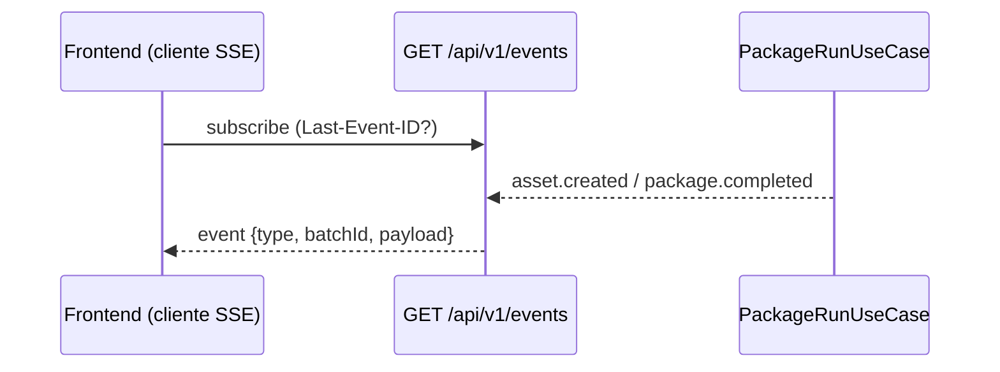

# 06. Vista de Tiempo de Ejecución

> Estado: **placeholder**. Diagramar desde specs 001–004 al implementar. Formato: Mermaid `sequenceDiagram`.

Secuencias pendientes:

1. **Ingesta** (spec 001): `Discord Gateway → DiscordBotListener → IngestUseCaseDiscord → Comentario{OTRO}` y `Telegram API → TelegramBotListener (long polling) → IngestUseCaseTelegram → Comentario{OTRO}` (bots ignorados, vacíos descartados, >2000 truncado con flag).
2. **Análisis IA** (spec 002): `UseCase → AnalyzePort → SpringAiAdapter → LLM → Structured Output`, timeout 15 s, 1 reintento, fallback `LLM_FALLBACK`.
3. **Generación multicanal** (spec 003): filtrado `relevance ≥ 60` → prompts por canal → `HallucinationGuard` → activos o `HALLUCINATION_BLOCKED`.
4. **Orquestación + OCI** (spec 004): `PackageRunUseCase` encadena 001→002→003 → `OciObjectStorageAdapter` → `201 {packageUrl}` / `207` con fallbacks; idempotencia por `batchId` (`deduped:true`).
5. **Suscripción SSE** (spec 004 RF-07): el dashboard abre `GET /api/v1/events` y escucha hasta que
   el pipeline emite eventos; reconexión con `Last-Event-ID` sin pérdida.

> [!TODO] Añadir diagrama de arranque (perfiles, validación de env `DISCORD_BOT_TOKEN`/`TELEGRAM_BOT_TOKEN`, degradado `*_NOT_CONFIGURED` + `503 *_NOT_CONFIGURED`) y de error global (`GlobalExceptionHandler` resto API, sin stacktraces ni PII).
