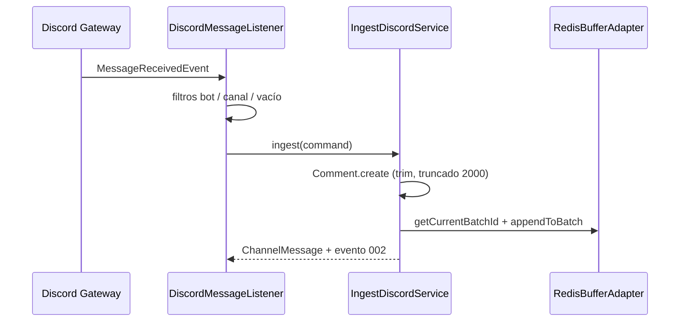
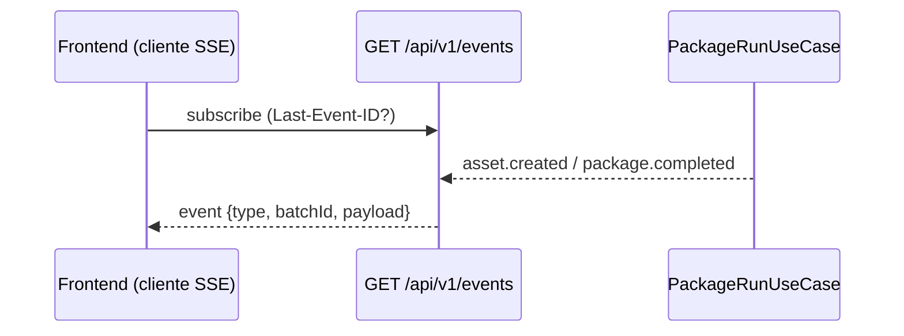

# 06. Vista de Tiempo de Ejecución

> Estado: **ingesta + buffer implementados; 002–004 según specs**. Formato: Mermaid `sequenceDiagram`.

1. **Ingesta** (spec 001, implementada): `Discord Gateway → DiscordMessageListener → IngestUseCaseDiscord → Comment{OTRO}` + `getCurrentBatchId` + `appendToBatch` + `publish IngestAcceptedEvent` (sin consumidor: 002 pendiente). Telegram long polling planificado, mismo flujo.

```mermaid
sequenceDiagram
    participant GW as Discord Gateway
    participant LI as DiscordMessageListener
    participant UC as IngestDiscordService
    participant RD as RedisBufferAdapter
    GW->>LI: MessageReceivedEvent
    LI->>LI: filtros bot / canal / vacío
    LI->>UC: ingest(command)
    UC->>UC: Comment.create (trim, truncado 2000)
    UC->>RD: getCurrentBatchId + appendToBatch
    UC-->>LI: ChannelMessage + evento 002
```
2. **Análisis IA** (spec 002): `UseCase → AnalyzePort → SpringAiAdapter → LLM → Structured Output`, timeout 15 s, 1 reintento, fallback `LLM_FALLBACK`.
3. **Generación multicanal** (spec 003): filtrado `relevance ≥ 60` → prompts por canal → `HallucinationGuard` → activos o `HALLUCINATION_BLOCKED`.
4. **Orquestación + OCI** (spec 004): `PackageRunUseCase` encadena 001→002→003 → `OciObjectStorageAdapter` → `201 {packageUrl}` / `207` con fallbacks; idempotencia por `batchId` (`deduped:true`).
5. **Suscripción SSE** (spec 004 RF-07): el dashboard abre `GET /api/v1/events` y escucha hasta que
   el pipeline emite eventos; reconexión con `Last-Event-ID` sin pérdida.

```mermaid
sequenceDiagram
    participant FE as Frontend (cliente SSE)
    participant API as GET /api/v1/events
    participant ORQ as PackageRunUseCase
    FE->>API: subscribe (Last-Event-ID?)
    ORQ-->>API: asset.created / package.completed
    API-->>FE: event {type, batchId, payload}
```

> Arranque (implementado): perfiles por env → valida `DISCORD_BOT_TOKEN` (fail-fast sin token) → Redis vía Docker Compose auto-arranque en local / contenedor en VM en prod (degradado `REDIS_NOT_CONFIGURED` sin tumbar ingesta) → CORS allowlist por env (falla si `*`) → `GET /actuator/health → UP`. Error global resto API: `GlobalExceptionHandler` (plan 004) con taxonomía §08, sin stacktraces ni PII.
