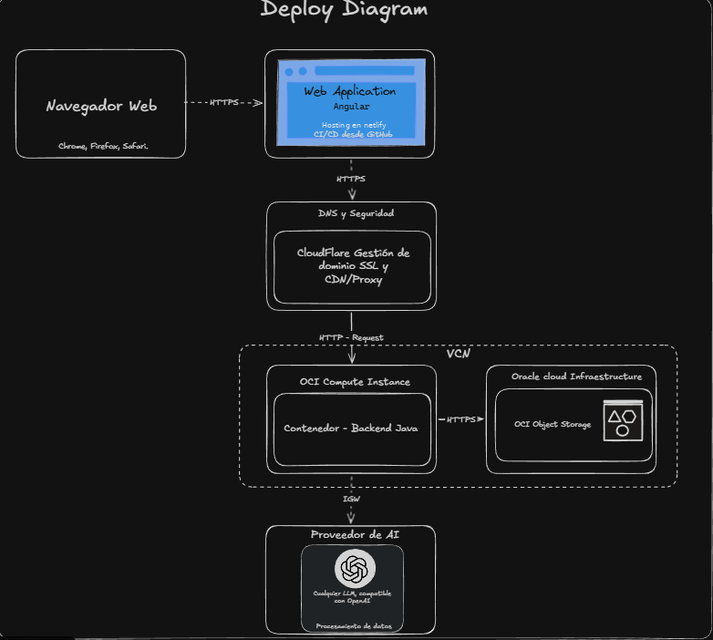

# 07. Vista de Despliegue

> El código aún no tiene `Dockerfile` ni perfiles (ver TD-3 en §11).

## Flujo (Diagrama de despliegue)

1. **Navegador** (Chrome/Firefox/Safari) → **Web Application Angular** por HTTPS (hosting Netlify, CI/CD desde GitHub).
2. **CloudFlare**: DNS, SSL, CDN/proxy y gestión de dominio delante del backend.
3. **VCN (OCI)**: Compute Instance con el backend Java en **contenedor** → HTTPS → **OCI Object Storage** (paquetes `< 1MB`); salida a internet por IGW hacia el **proveedor de IA** (OpenAI).
4. Sin base de datos en ningún nodo (ADR-002). Todo el stack declarado es tier gratuito (CO-5).

## Mapeo bloques → artefactos (previsto)

- Backend: jar único Spring Boot (`local`/`prod` por env, sin credenciales en imagen) en contenedor sobre Compute Instance.
- Frontend: estático en Netlify; alcanza al backend por URL pública con `CORS_ALLOWED_ORIGINS` correspondiente.
- Variables requeridas: `OPENAI_API_KEY` (+ `OPENAI_MODEL`), `OCI_BUCKET`, `OCI_REGION`, `CORS_ALLOWED_ORIGINS`.

> [!TODO] Bucket real (nombre, región, prefijo `paquetes/`), URLs/DNS reales y shape de la Compute Instance.
> `Dockerfile` + `.dockerignore` pendientes (TD-3).
