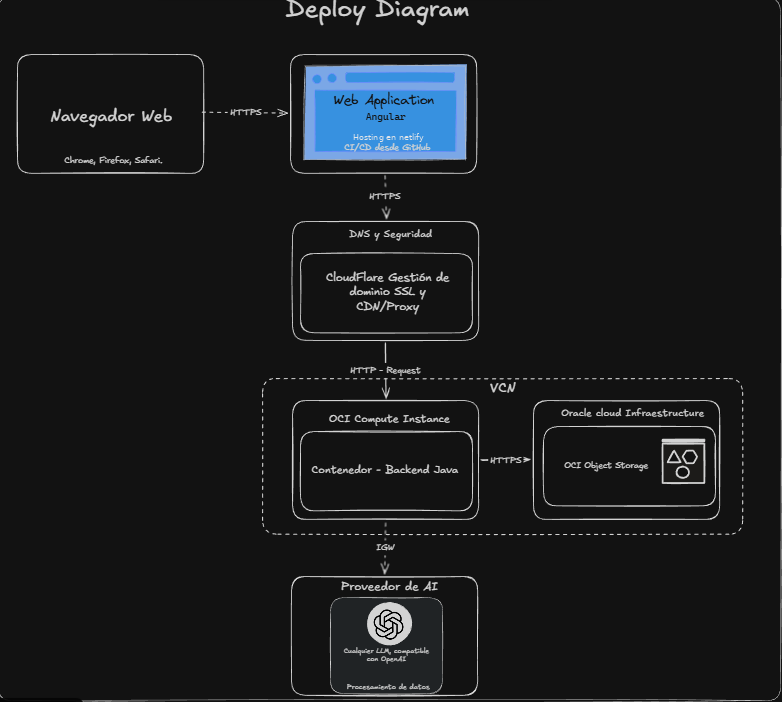

# 07. Vista de Despliegue

> El código aún no tiene `Dockerfile` ni perfiles (ver TD-3 en §11).

## Flujo (Diagrama de despliegue)

1. **Navegador** (Chrome/Firefox/Safari) → **aplicación web externa** por HTTPS (hosting fuera del alcance backend).
2. **CloudFlare**: DNS, SSL, CDN/proxy y gestión de dominio delante del backend.
3. **VCN (OCI)**: Compute Instance con el backend Java en **contenedor** + Redis en **contenedor hermano en la misma VM** → HTTPS → **OCI Object Storage** (paquetes `<1MB`); salida a internet por IGW hacia el **proveedor de IA** (OpenAI), conexión persistente Gateway hacia **Discord** (bot JDA) y long polling hacia **Telegram** (bot TelegramBots planificado), ambos con token por env. En local, Redis corre vía `docker-compose-dev.yaml` con auto-arranque Spring Boot.
4. Sin base de datos en ningún nodo (ADR-002). Todo el stack declarado es tier gratuito (CO-5). Sin token, el bot correspondiente queda `*_NOT_CONFIGURED` y el resto sigue UP.

## Mapeo bloques → artefactos (previsto)

- Backend: jar único Spring Boot (`dev`/`prod` por env, sin credenciales en imagen) en contenedor sobre Compute Instance; Redis en contenedor hermano (datos en volumen, nunca en git).
- Frontend: aplicación externa; alcanza al backend por URL pública con `CORS_ALLOWED_ORIGINS` correspondiente (el hosting del frontend queda fuera de este documento).
- Variables requeridas: `API_KEY_LLM_MISTRAL_DEV` (+ `MODEL_MISTRAL`, `BASE_URL_MODEL_AI` requerido), `OCI_BUCKET`, `OCI_REGION`, `CORS_ALLOWED_ORIGINS`, `DISCORD_BOT_TOKEN`, `TELEGRAM_BOT_TOKEN` (+ `TELEGRAM_BOT_USERNAME` opcional).

> [!TODO] Bucket real (nombre, región, prefijo `paquetes/`), URLs/DNS reales y shape de la Compute Instance.
> `Dockerfile` + `.dockerignore` pendientes (TD-3).
