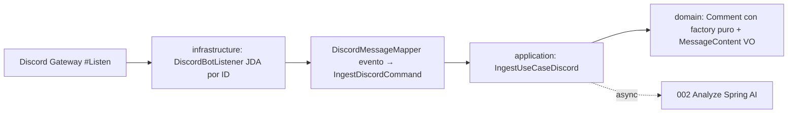

# Plan 001: Ingesta normalizada vía bot Discord JDA en `#Listen` por ID (sin endpoint REST)

Derivado de: `spec.md RF-01a,RF-02..RF-05 + RNF-01..RNF-03` + `constitution.md v1.2-redis-buffer, P1-P3,P5,R1-R2,R4-R6,R8,Q1-Q5`.
Alcance semanal: solo `DISCORD` en `#Listen` por ID (`DISCORD_LISTEN_CHANNEL_ID`). `TELEGRAM` deferrado esta semana. Sin `POST /api/v1/ingest` genérico ni `/ingest/discord`. Secuencia: `Bot #Listen → LLM por mensaje (002) → etiquetas (003) → fork: SSE inmediato + buffer Redis por tamaño → OCI batch + frontend (004)`, `N mensajes = 1 paquete`.

## 1. Arquitectura y componentes (hexagonal estricto)

* `domain/`: records `Comment{messageId, channelId informativo, author, content (truncado a 2000 si excede), truncated, sentTime, source:DISCORD}`, `Source{DISCORD,TELEGRAM}`, `MessageType{...}` (reservado para 002), VO `MessageContent` + factory `Comment.create` (sin `CommentValidator`: la validación vive en el factory + VO). Sin Spring/JPA/Lombok-lógica (R3). Normalización pura: trim, truncado a 2000 + flag, ids/`sentTime`/`source` requeridos. `id=messageId` nativo Discord (sin uuid por mensaje); `batchId` no vive en dominio 001, es el `uuid` del lote abierto en Redis (`buffer:current:id`, ver 004) asignado en `application` al ingerir. Sin `type` (lo clasifica la IA en 002). Filtro por ID fuera de dominio (en listener).
* `application/`: `ports/in/IngestUseCaseDiscord`, `command/IngestDiscordCommand`, `dtos/ChannelMessage`, `services/IngestDiscordService`. Asigna `batchId=lote abierto` vía `BufferPort.getCurrentBatchId()` (puerto owned en 004, impl Redis en `infrastructure/`). Retorna en `<300ms` y dispara `002` en background (`@Async`/evento, no bloquea Gateway). Sin `@Controller,@Entity,SDKs`. `IngestUseCaseTelegram` deferrado.
* `infrastructure/adapters`: `DiscordBotListener` (JDA `MessageReceivedEvent`, filtro `event.channel.id == ${DISCORD_LISTEN_CHANNEL_ID}`, ignora `author.isBot`, ignora DMs/hilos/otros canales en silencio, descarta vacío, trunca >2000) + `DiscordMessageMapper` + `DiscordConfig` + acuse `✅ (201) / ⚠️ (fallback/OCI-fail)` sin contenido ni PII. Sin negocio, solo adaptación. JDA solo aquí tras `IngestUseCaseDiscord`.
* `interfaces/`: sin controller de ingesta. Solo `GlobalExceptionHandler` compartido para el resto de la API (R2).

Contrato interno: evento válido en `#Listen` → `Comment` con `{id=messageId nativo, batchId=lote abierto Redis}` en p95<300ms local (sin LLM) + disparo async a `002`. Tras `002+003` hay fork (ver 004): `SSE inmediato asset.created` + `RPUSH buffer Redis`. Mensaje de bot, vacío o fuera de `#Listen` → descarte silencioso sin PII en logs (solo `messageId,batchId,source`). Texto >2000 → truncado a 2000 con `truncated:true`. Sin `202/400/413/429` HTTP para ingesta.

## 2. Decisiones técnicas y trade-offs

* Decisión: Redis buffer por tamaño en bytes (`spring-data-redis`, solo Java sin Lua) como contenedor de lote (`buffer:current:list` LIST + `buffer:current:ids` SET dedup + `buffer:current:bytes` contador + `buffer:current:id` uuid lote). Flush a OCI al alcanzar `REDIS_BUFFER_MAX_BYTES=921600 (900KB)`.
  Alternativa descartada: `1:1 directo a OCI` (1 mensaje = 1 paquete).
  Razón: agrupar N mensajes en 1 objeto `<1MB` abarata PUTs OCI + eventos SSE batch, mantiene LLM por mensaje para UX realtime vía fork `SSE inmediato + buffer`. Requiere enmienda (Redis fuera de tabla cerrada v1.1).
* Decisión: JDA (`net.dv8tion:JDA`) como cliente Gateway en `infrastructure/`, filtro por `channelId == ${DISCORD_LISTEN_CHANNEL_ID}`.
  Alternativa descartada: endpoint REST de ingesta (`POST /api/v1/ingest` o `/ingest/discord`) o filtro por nombre.
  Razón: el bot recibe el evento nativo sin exponer REST; por ID es estable ante renombres de `#Listen`, por nombre es frágil. Requiere enmienda (fuera de tabla cerrada).
* Decisión: Telegram deferrado esta semana (spec RF-01b reservado).
  Alternativa descartada: ambos bots en paralelo.
  Razón: foco Discord `#Listen` → LLM → OCI → frontend con 2 devs; Telegram en Fase>1-semana sin cambiar `domain`.
* Decisión: truncar >2000 a 2000 con `truncated:true` (Discord) en vez de descartar.
  Alternativa descartada: descartar >2000 o aceptar 4096 nativo solo en Telegram.
  Razón: uniformidad del dominio 1..2000 + no perder mensajes largos; la IA no penaliza por corte (ver 002).
* Decisión: validación pura en `domain` (factory `Comment.create` + VO `MessageContent`, sin clase `CommentValidator`) sin Bean Validation HTTP para ingesta (no hay body REST).
  Alternativa descartada: DTOs con `jakarta.validation` o `CommentValidator` como fachada separada.
  Razón: no hay request HTTP; `spring-boot-starter-validation` sigue aplicando al resto de la API (004), no a este flujo; el factory + VO ya cubren el todo (objeto) y las partes (texto) sin duplicar.
* Decisión: sin rate-limit en el backend en Fase 1.
  Alternativa descartada: rate-limit in-memory o Bucket4j/Redis con `429`.
  Razón:
    1. Por alcance del MVP: el throttling queda fuera para no ampliar superficie ni dependencias.
    2. Por complejidad alta y riesgo de pérdida: un `429` puede hacer que se pierdan mensajes en las conversaciones de Discord/Telegram. La protección queda en filtro anti-bot + texto 1..2000 + validación estricta.
* Decisión: `channel` = nombre informativo + filtro duro por ID (`DISCORD_LISTEN_CHANNEL_ID`), acuse `✅/⚠️` sin contenido.
  Alternativa descartada: sin allowlist o filtrar por nombre.
  Razón: decisión semanal: solo `#Listen`; por ID estable, resto se ignora sin coste LLM.
* Decisión: `type=OTRO` fijo a la entrada; la IA clasifica en 002.
  Alternativa descartada: inferir por canal/prefijo en 001.
  Razón: el contenido manda y la clasificación es negocio de IA, no de parsing.

## 3. Estrategia de pruebas

* `domain`: unit `CommentTest` (trim, truncado 2000 + flag, emoji sin partir, ids/`sentTime`/`source` requeridos).
* `application`: unit `IngestDiscordService` con comando fake (válido `#Listen`, vacío, >2000 truncado, de bot → descarte, fuera de `#Listen` → descarte).
* `infrastructure`: unit `DiscordBotListener/Mapper` con eventos JDA fake (ID igual/distinto, bot ignorado, truncado marcado, acuse ✅/⚠️).
* Sin `webmvc-test` para ingesta (no hay endpoint).
* Meta Q1: ≥80% `domain+application` (JaCoCo cuando se añada).

## 4. Seguridad básica Q3 + RNF + config

Token `DISCORD_BOT_TOKEN` + filtro `DISCORD_LISTEN_CHANNEL_ID` solo por env/perfil, nunca en repo (R4). Custodia/rotación por definir (dueño TBD, ver §11). Intents Discord `MESSAGE_CONTENT`/`GUILD_MESSAGES` + permisos `AddReactions/SendMessages` solo para acuse. Discord/Telegram son dependencias fundamentales sin sustituto: sin proveedor no hay ingesta y por tanto no hay pipeline (a diferencia del LLM, sustituible entre modelos con `LLM_FALLBACK` en 002). Orden de validación: primero funcionalidad (token válido + handshake JDA + primer evento `#Listen`), después velocidad. El presupuesto `R6 <15s` aplica cuando el proveedor responde; la latencia del handshake queda excluida del cómputo, igual que la latencia LLM en 002. Sin token → fail-fast de arranque con error claro (no UP fingido). Sin PII en logs (solo `messageId,source`). Resto de la API: CORS allowlist `${CORS_ALLOWED_ORIGINS}`, headers `nosniff/DENY`, CSRF off.

## 5. Verificación

* `./mvnw test -Dtest=*IngestDiscord*,*Comment*,*Discord*`
* `./mvnw test` verde obligatorio antes de PR.
* `./mvnw spring-boot:run` con token + ID prueba → mensaje `#Listen` normalizado `<300ms` + disparo a `002`; otro canal → ignorado; `GET /actuator/health` sigue UP (004).
* Arranque con proveedor alcanzable `<15s` (R6, handshake excluido); arranque sin token → falla rápido con `Discord token is required`, sin fingir UP.
