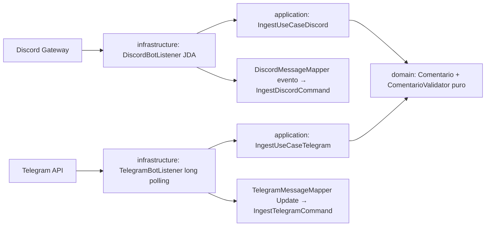

# Plan 001: Ingesta normalizada vía bots Discord JDA + Telegram TelegramBots (sin endpoint REST)

Derivado de: `spec.md RF-01a,RF-01b,RF-02..RF-05 + RNF-01..RNF-03` + `constitution.md v1.1-bots, P1-P3,P5,R1-R2,R4-R6,R8,Q1-Q5`.
Alcance: `DISCORD` vía bot JDA + `TELEGRAM` vía bot TelegramBots long polling (el backend es ambos bots). Sin `POST /api/v1/ingest` genérico ni `/ingest/discord`. `tasks.md` pendiente por decisión de producto (no se crea en este cambio).

## 1. Arquitectura y componentes (hexagonal estricto)

* `domain/`: records `Comentario{id, batchId, source, author, channel=nombre del canal/chat, type=OTRO, text (truncado a 2000 si excede), truncated, timestamp}`, `Source{DISCORD,TELEGRAM}`, `MessageType{...}`. Sin Spring/JPA/Lombok-lógica (R3). Normalización pura: trim, truncado a 2000 + flag, UTC, `uuid` para `id`. Sin IDs ni allowlist.
* `application/`: `ports/in/IngestUseCaseDiscord + IngestUseCaseTelegram`, `command/IngestDiscordCommand + IngestTelegramCommand`, `dtos/ComentarioDto`, `services/IngestDiscordService + IngestTelegramService`. Sin `@Controller,@Entity,SDKs`.
* `infrastructure/adapters`: `DiscordBotListener` (JDA `MessageReceivedEvent`, ignora `author.isBot`, descarta vacío, trunca >2000) + `DiscordMessageMapper`, y `TelegramBotListener` (TelegramBots long polling, ignora `from.isBot`, descarta vacío, trunca >2000) + `TelegramMessageMapper`. Sin negocio, solo adaptación. JDA/TelegramBots solo aquí tras su `IngestUseCase*`.
* `interfaces/`: sin controller de ingesta. Solo `GlobalExceptionHandler` compartido para el resto de la API (R2).

Contrato interno: evento válido (Discord o Telegram) → `Comentario` con `{id,batchId}` en p95<300ms local (sin LLM). Mensaje de bot o vacío → descarte silencioso sin PII en logs. Texto >2000 → truncado a 2000 con `truncated:true`. Sin `202/400/413/429` HTTP para ingesta.

## 2. Decisiones técnicas y trade-offs

* Decisión: JDA (`net.dv8tion:JDA`) como cliente Gateway en `infrastructure/`.
  Alternativa descartada: endpoint REST de ingesta (`POST /api/v1/ingest` o `/ingest/discord`).
  Razón: Discord y Telegram envían distinto formato/parámetros; el bot recibe el evento nativo sin exponer superficie REST ni pedir reenvíos manuales. Requiere enmienda (fuera de tabla cerrada).
* Decisión: TelegramBots long polling (`org.telegram:telegrambots`) como cliente en `infrastructure/`.
  Alternativa descartada: RestClient directo al Bot API sin SDK, o webhook con URL pública.
  Razón: por rapidez de desarrollo (parsing de `Update` + polling + reconexión ya resueltos, compensa la enmienda); long polling temporal MVP sin URL pública ni infra extra ($0, demo simple); webhook en Fase >1. Requiere enmienda (fuera de tabla cerrada).
* Decisión: truncar >2000 a 2000 con `truncated:true` (ambas fuentes) en vez de descartar.
  Alternativa descartada: descartar >2000 o aceptar 4096 nativo solo en Telegram.
  Razón: uniformidad del dominio 1..2000 + no perder mensajes largos; la IA no penaliza por corte (ver 002).
* Decisión: validación pura en `domain` (`ComentarioValidator`) sin Bean Validation HTTP para ingesta (no hay body REST).
  Alternativa descartada: DTOs con `jakarta.validation`.
  Razón: no hay request HTTP; `spring-boot-starter-validation` sigue aplicando al resto de la API (004), no a este flujo.
* Decisión: sin rate-limit en el backend en Fase 1.
  Alternativa descartada: rate-limit in-memory o Bucket4j/Redis con `429`.
  Razón:
    1. Por alcance del MVP: el throttling queda fuera para no ampliar superficie ni dependencias.
    2. Por complejidad alta y riesgo de pérdida: un `429` puede hacer que se pierdan mensajes en las conversaciones de Discord/Telegram. La protección queda en filtro anti-bot + texto 1..2000 + validación estricta.
* Decisión: `channel` = nombre del canal, sin Channel ID ni allowlist.
  Alternativa descartada: filtrar por IDs.
  Razón: decisión de producto, solo importa el contenido del mensaje.
* Decisión: `type=OTRO` fijo a la entrada; la IA clasifica en 002.
  Alternativa descartada: inferir por canal/prefijo en 001.
  Razón: el contenido manda y la clasificación es negocio de IA, no de parsing.

## 3. Estrategia de pruebas

* `domain`: unit `ComentarioValidator` (trim, truncado 2000 + flag, UTC, uuid, `OTRO` fijo).
* `application`: unit `IngestDiscordService` + `IngestTelegramService` con comando fake (válido, vacío, >2000 truncado, de bot → descarte).
* `infrastructure`: unit `DiscordBotListener/Mapper` con eventos JDA fake + `TelegramBotListener/Mapper` con `Update` fake (bot ignorado, truncado marcado).
* Sin `webmvc-test` para ingesta (no hay endpoint).
* Meta Q1: ≥80% `domain+application` (JaCoCo cuando se añada).

## 4. Seguridad básica Q3 + RNF + config

Token `DISCORD_BOT_TOKEN` y `TELEGRAM_BOT_TOKEN` (+ `TELEGRAM_BOT_USERNAME` opcional) solo por env/perfil, nunca en repo (R4). Custodia/rotación por definir (dueño TBD, ver §11). Intents Discord `MESSAGE_CONTENT`/`GUILD_MESSAGES`; Telegram long polling (webhook en Fase >1). Sin token → bot correspondiente degradado `*_NOT_CONFIGURED`, resto (health/Swagger/OCI) sigue UP. Sin PII en logs (solo `id,batchId,source`). Resto de la API: CORS allowlist `${CORS_ALLOWED_ORIGINS}`, headers `nosniff/DENY`, CSRF off.

## 5. Verificación

* `./mvnw test -Dtest=*IngestDiscord*,*IngestTelegram*,*Comentario*,*Discord*,*Telegram*`
* `./mvnw test` verde obligatorio antes de PR.
* `./mvnw spring-boot:run` con tokens de prueba → mensajes Discord/Telegram de prueba normalizados; `GET /actuator/health` sigue UP (004).
