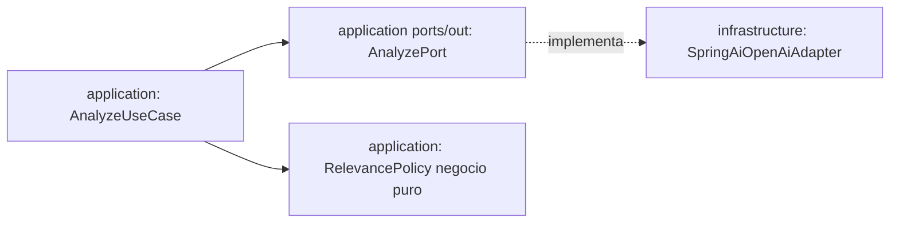

# Plan 002: Análisis con IA OpenAI vía Spring AI (sentimiento, temas, relevancia)

Derivado de: `spec.md RF-01..RF-05 + RNF-01..RNF-03` + `constitution.md P1-P2,R1,R4-R6,Q1-Q3,Fase1`.
Proveedor: **OpenAI único vía Spring AI** (`spring-ai-starter-model-openai`, BOM `spring-ai-bom`). Modelo por env sin recódigo. Alcance semanal: Discord-only (entrada `type=OTRO` de 001 Discord).

## 1. Arquitectura y componentes

* `domain`: `EnrichedComment = Comment + {type clasificado, sentiment, topics[1..5], relevance 0..100, language, flag?}`, `Sentiment{POSITIVO,NEUTRAL,NEGATIVO}`, `Language{es,en,pt,other}`. Entrada siempre `OTRO` (001 Discord esta semana; Telegram deferrado, fuera de alcance semanal). La IA clasifica a `TESTIMONIO|LOGRO|DUDA|OTRO`. Si `truncated:true`, no penalizar por corte. Reglas negocio puras en `RelevancePolicy`: `LOGRO/TESTIMONIO positivo > DUDA`, `<15 chars → irrelevante`.
* `application`: `ports/in/AnalyzeUseCase`, `ports/out/AnalyzePort`, `services/AnalyzeService` (invocado directo tras `001` en background; si `LLM_FALLBACK` → `PackageRunService` **aborta sin 003/OCI/SSE**, solo `LOG + ⚠️`).
* `infrastructure`: `SpringAiOpenAiAdapter` tras `AnalyzePort` con **Spring AI real esta semana**: `ChatClient` (OpenAI, `spring-ai-starter-model-openai` + BOM) + structured-output (`BeanOutputConverter` contra schema) + `timeout 15s + 1 reintento + fallback LLM_FALLBACK`, `promptVersion:v1`, temperatura `0.1-0.2`. Config `spring.ai.openai.api-key=${OPENAI_API_KEY}`, `spring.ai.openai.chat.options.model=${OPENAI_MODEL:gpt-4o-mini}`, solo en `infrastructure/config`. Anónimo total: solo `text+type` al LLM, nunca `author/ids/channel`. Key solo por env, nunca en logs/respuestas. Sin `OPENAI_API_KEY` → degradado `LLM_NOT_CONFIGURED` con abort sin tumbar health.

Contrato interno: entrada `Comment` de `#Listen` (`type=OTRO`, quizá `truncated:true`), salida `EnrichedComment` o `LLM_FALLBACK → abort`. Secuencia: `Bot #Listen → LLM (002) → etiquetas (003) → OCI + SSE (004)`.

## 2. Decisiones técnicas y trade-offs

* Decisión: añadir `org.springframework.ai:spring-ai-starter-model-openai` con BOM `spring-ai-bom` **esta semana** (configuración LLM del pipeline), `ChatClient` + `BeanOutputConverter` en `infrastructure/`.
  Alternativa descartada: `RestClient` manual contra API OpenAI sin Spring AI.
  Razón: contrato único OpenAI exigido por constitución §2 + salida estructurada validable (spec RF-02 ≥99% sin `repair`) + modelo por env sin recódigo (spec RF-05) + prompts versionados trazables; `RestClient` duplicaría parsing/reintentos. Requiere verificar compatibilidad BOM con Boot `4.1.1` en `pom.xml` antes del primer `test`. Si el BOM rompe offline, se fija versión y se documenta en §11.
* Decisión: `promptVersion:v1` trazable en respuesta + temperatura baja (`0.1-0.2`) + `max 500 comentarios/lote`.
  Alternativa: prompt libre.
  Razón: auditoría jurado + RNF-03 coste acotado.
* Decisión: Discord-only esta semana; Telegram deferrado.
  Alternativa: ambos bots en paralelo.
  Razón: foco pipeline completo Discord→OCI→Frontend sin dividir capacidad (2 devs).

## 3. Estrategia de pruebas

* Unit `RelevancePolicy` (LOGRO>DUDA, <15 chars), unit `AnalyzeService` con `AnalyzePort` fake (válido → enriquecido; schema inválido → `LLM_FALLBACK → abort` sin `500`).
* Adapter `SpringAiOpenAiAdapterTest` con `ChatClient` mockeado: JSON schema inválido → 1 reintento → fallback `LLM_FALLBACK`; sin `OPENAI_API_KEY` → degradado sin `500`.
* Cobertura ≥80% `domain+application`.

## 4. Seguridad/RNF

`OPENAI_API_KEY,OPENAI_MODEL` solo env. Latencia LLM excluida de `p95<300ms` ingesta; documentar `p50/p95` observados. Anónimo total: solo `text+type` al LLM, nunca `author/ids/channel`; logs solo `id,batchId,source`.

## 5. Verificación

* `./mvnw test -Dtest=*Analyze*,*Relevance*`
* `./mvnw test` verde.
