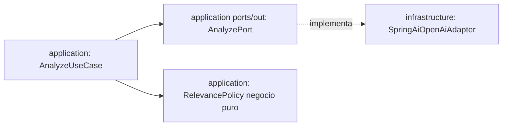

# Plan 002: Análisis con IA OpenAI (sentimiento, temas, relevancia)

Derivado de: `spec.md RF-01..RF-05 + RNF-01..RNF-03` + `constitution.md P1-P2,R1,R4-R6,Q1-Q3,Fase1`.
Proveedor: **OpenAI único vía Spring AI** (sin Mistral, sin cambios). Modelo por env sin recódigo.

## 1. Arquitectura y componentes

* `domain`: `ComentarioEnriquecido = Comentario + {type clasificado, sentiment, topics[1..5], relevance 0..100, language, flag?}`, `Sentiment{POSITIVO,NEUTRAL,NEGATIVO}`, `Language{es,en,pt,other}`. Entrada siempre `OTRO` (Discord o Telegram); la IA clasifica a `TESTIMONIO|LOGRO|DUDA|OTRO`. Si `truncated:true`, no penalizar por corte. Reglas negocio puras en `RelevancePolicy`: `LOGRO/TESTIMONIO positivo > DUDA`, `<15 chars → irrelevante`.
* `application`: `ports/in/AnalyzeUseCase`, `ports/out/AnalyzePort`, `services/AnalyzeService` (tolerante a fallos: 1 fallo no rompe lote, cuenta `analyzed,fallbackCount`).
* `infrastructure`: `SpringAiOpenAiAdapter` tras `AnalyzePort`. Fase actual: implementación con `RestClient` + structured-output validado + `timeout 15s + 1 reintento + fallback LLM_FALLBACK`, lista para cambiar a `spring-ai-starter-model-openai` sin tocar `domain/application` cuando haya `OPENAI_API_KEY`. Key solo por env, nunca en logs/respuestas.

Contrato interno: entrada `Comentario[]` (de 001, 1 mensaje Discord o Telegram con `type=OTRO`, quizá `truncated:true`), salida `ComentarioEnriquecido[]` con `type` clasificado, JSON validable ≥99% o fallback.

## 2. Decisiones técnicas y trade-offs

* Decisión: no añadir `spring-ai-starter-model-openai` esta semana, usar `RestClient` (ya en `pom.xml`) con misma interfaz `AnalyzePort`.
  Alternativa descartada: añadir Spring AI sin keys verificadas.
  Razón: Boot 4.1.1 + Spring AI sin BOM verificado rompería `./mvnw test` offline; diseño deja cambio a Spring AI sin tocar núcleo (P1/P2). Documentado como deuda en §11.
* Decisión: `promptVersion:v1` trazable en respuesta + temperatura baja.
  Alternativa: prompt libre.
  Razón: auditoría jurado + RNF-03 coste acotado `max 500/lote`.

## 3. Estrategia de pruebas

* Unit `RelevancePolicy` (LOGRO>DUDA, <15 chars), unit `AnalyzeService` con `AnalyzePort` fake (9/10 +1 fallback sin 500).
* Adapter test con JSON schema inválido → 1 reintento → fallback.
* Cobertura ≥80% `domain+application`.

## 4. Seguridad/RNF

`OPENAI_API_KEY,OPENAI_MODEL` solo env. Latencia LLM excluida de `p95<300ms` ingesta; documentar `p50/p95` observados. Sin PII a LLM (solo `text+type`, nunca autor/ids).

## 5. Verificación

* `./mvnw test -Dtest=*Analyze*,*Relevance*`
* `./mvnw test` verde.
