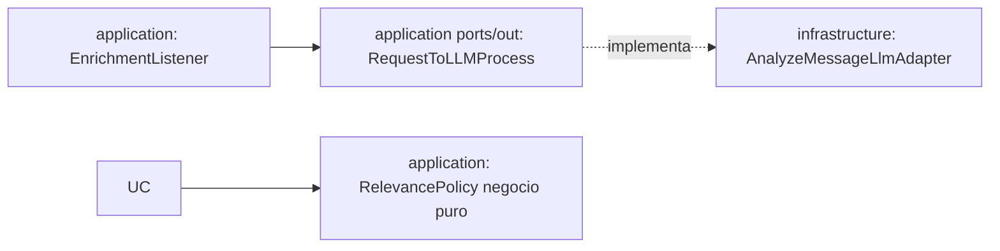

# Plan 002: Análisis IA bajo contrato OpenAI vía Spring AI (sentimiento, temas, relevancia)

Derivado de: `spec.md RF-01..RF-05 + RNF-01..RNF-03` + `constitution.md v1.3-openai-contract, P1-P2,R1,R4-R6,Q1-Q3,Fase1`.
Proveedor: **contrato API OpenAI vía Spring AI** (`spring-ai-starter-model-openai`, BOM `spring-ai-bom`), vendor-agnóstico (ej. Mistral vía `base-url`). Modelo y endpoint por env sin recódigo. Alcance semanal: Discord-only (entrada `type=OTRO` de 001 Discord).

## 1. Arquitectura y componentes

```mermaid
flowchart LR
  L[application: EnrichmentListener] --> AP[application ports/out: RequestToLLMProcess]
  AP -.implementa.-> OAI[infrastructure: AnalyzeMessageLlmAdapter]
  UC --> POL[application: RelevancePolicy negocio puro]
```

* `domain`: `EnrichedComment = Comment + {type clasificado, sentiment, topics[1..5], relevance 0..100, language, flag?}`, `Sentiment{POSITIVO,NEUTRAL,NEGATIVO}`, `Language{ES,EN,PT,OTHER}` (mayúsculas por convención Java; wire = nombre de la constante). Entrada siempre `OTRO` (001 Discord esta semana; Telegram deferrado, fuera de alcance semanal). La IA clasifica a `TESTIMONIO|LOGRO|DUDA|OTRO`. Si `truncated:true`, no penalizar por corte. Reglas negocio puras en `RelevancePolicy`: `LOGRO/TESTIMONIO positivo > DUDA`, `<15 chars → irrelevante`.
* `application`: `ports/out/RequestToLLMProcess`, `services/ai/EnrichmentListener` (invocado por evento `IngestAcceptedEvent` tras `001`; si `LLM_FALLBACK` → traza bufferizada **abort sin 003/OCI/SSE de paquete**, solo `LOG + ⚠️`), `services/comment/ConvertEnrichedCommentService` (ensambla `EnrichedComment` con `RelevancePolicy.score`).
* `infrastructure`: `AnalyzeMessageLlmAdapter` tras `RequestToLLMProcess` con **Spring AI real esta semana**: `ChatClient` (contrato OpenAI, `spring-ai-starter-model-openai` + BOM) + structured-output (`BeanOutputConverter` contra schema) + `timeout 15s + 1 reintento + fallback LLM_FALLBACK`, `promptVersion:v1`, temperatura `0.1-0.2`. Config `spring.ai.openai.api-key=${API_KEY_LLM_MISTRAL_DEV}`, `spring.ai.openai.chat.options.model=${MODEL_MISTRAL}`, `spring.ai.openai.base-url=${BASE_URL_MODEL_AI}` (requerido para dirigir la request según proveedor), solo en `infrastructure/config`. Anónimo total: solo `text+type` al LLM, nunca `author/ids/channel`. Key solo por env, nunca en logs/respuestas. Sin `API_KEY_LLM_MISTRAL_DEV` o sin `BASE_URL_MODEL_AI` → degradado `LLM_NOT_CONFIGURED` con abort sin tumbar health.

Contrato interno: entrada `Comment` de `#Listen` (`type=OTRO`, quizá `truncated:true`), salida `EnrichedComment` o `LLM_FALLBACK → abort`. Secuencia: `Bot #Listen → LLM (002) → etiquetas (003) → OCI + SSE (004)`.

## 2. Decisiones técnicas y trade-offs

* Decisión: añadir `org.springframework.ai:spring-ai-starter-model-openai` con BOM `spring-ai-bom` **esta semana** (configuración LLM del pipeline), `ChatClient` + `BeanOutputConverter` en `infrastructure/`.
  Alternativa descartada: `RestClient` manual contra API OpenAI sin Spring AI.
  Razón: contrato OpenAI vendor-agnóstico exigido por constitución v1.3 + salida estructurada validable (spec RF-02 ≥99% sin `repair`) + modelo/endpoint por env sin recódigo (spec RF-05, `MODEL_MISTRAL` + `BASE_URL_MODEL_AI` requerido para dirigir la request según proveedor) + prompts versionados trazables; `RestClient` duplicaría parsing/reintentos. Requiere verificar compatibilidad BOM con Boot `4.1.1` en `pom.xml` antes del primer `test`. Si el BOM rompe offline, se fija versión y se documenta en §11.
* Decisión: `promptVersion:v1` trazable en respuesta + temperatura baja (`0.1-0.2`) + `max 500 comentarios/lote`.
  Alternativa: prompt libre.
  Razón: auditoría jurado + RNF-03 coste acotado.
* Decisión: Discord-only esta semana; Telegram deferrado.
  Alternativa: ambos bots en paralelo.
  Razón: foco pipeline completo Discord→OCI→Frontend sin dividir capacidad (2 devs).

## 3. Estrategia de pruebas

* Unit `RelevancePolicy` (LOGRO>DUDA, <15 chars), unit `AnalyzeMessageLlmAdapter` con `ChatClient` mockeado (válido → enriquecido; schema inválido → `LLM_FALLBACK → abort` sin `500`).
* Adapter `AnalyzeMessageLlmAdapterTest` con `ChatClient` mockeado: JSON schema inválido → 1 reintento → fallback `LLM_FALLBACK`; sin `API_KEY_LLM_MISTRAL_DEV` o sin `BASE_URL_MODEL_AI` → degradado sin `500`. Unit `LlmOutputSanitizerTest` para la higiene de wire-format (fences, recorte balanceado ignorando llaves en strings, candidatos + fingerprint).
* Cobertura ≥80% `domain+application`.

## 4. Seguridad/RNF

`API_KEY_LLM_MISTRAL_DEV,MODEL_MISTRAL,BASE_URL_MODEL_AI` solo env. Latencia LLM excluida de `p95<300ms` ingesta; documentar `p50/p95` observados. Anónimo total: solo `text+type` al LLM, nunca `author/ids/channel`; logs solo `id,batchId,source`.

## 5. Verificación

* `./mvnw test -Dtest=*Analyze*,*Relevance*`
* `./mvnw test` verde.

## Apéndice A — Rate-limit + concurrencia LLM (implementado `feature/optimization-backend-001`)

> Decisiones confirmadas por el dev (2026-10-06). `Derivado de: spec 002 RF-04 + plan §2/§4`.

* **Qué:** doble gate en `AnalyzeMessageLlmAdapter.callLimited`: `Semaphore(3)` + Bucket4j `Bucket(3 cap / refillIntervally 3 cada 60s)` vía `RateLimitAiConfig` (`infrastructure/config/bucket`). `processMessage` mantiene `timeout 15s + 1 reintento + fallback LLM_FALLBACK, nunca 500`; el port `RequestToLLMProcess` ahora declara `throws InterruptedException` y `EnrichmentListener` lo mapea a `LLM_FALLBACK`.
* **Decisión librería:** Bucket4j.
  Alternativa descartada: Resilience4j / Redis distribuido / contador atómico artesanal.
  Razón (dev): simpleza single-VM demo, sin infra extra para 1 instancia.
* **Decisión valores:** `3 / 3 por 60s + Semaphore(3)` por cuota real del proveedor (no inventado). Quedan como constantes iniciales; evolución a env (`LLM_MAX_RPS`) registrada como pendiente.
* **Decisión bloqueo:** se deja `asBlocking().consume(1)` bloqueante aunque puede esperar hasta 60s si se agota. Decisión consciente (el pool `@Async` lo absorbe en demo). Deuda: evaluar `tryConsume + LLM_FALLBACK inmediato` si hay agotamiento del pool.
* **Decisión logs:** 4 logs de gate en español claro, nivel `debug` en prod (antes `info` en demo) + `warn` solo en `intento 1/2 fallido` y saturación. Sin PII: solo `semaforos disponibles/libres + tokens disponibles/restantes`, nunca `message/author/ids`. Tabla:
  | Cuándo | Mensaje | Nivel |
  |---|---|---|
  | Antes de `acquire` | `LLM puerta de entrada, antes de pedir permiso: semaforos disponibles={} tokens disponibles={}` | `debug` |
  | Tras `acquire` | `LLM permiso concedido: semaforos libres={} tokens disponibles={}` | `debug` |
  | Tras `consume` | `LLM turno consumido, llamando al modelo: semaforos libres={} tokens restantes={}` | `debug` |
  | En `finally` tras `release` | `LLM permiso liberado: semaforos disponibles={}` | `debug` |
* **Incidencia resuelta:** colisión `bean 'rateLimitAi'` (`@Configuration RateLimitAi` + `@Bean rateLimitAi()` con `overriding=false`) → renombrado a `RateLimitAiConfig` (bean `rateLimitAiConfig` vs bean `rateLimitAi`).
* **Tests (solo `src/test/`, verdes):** `AnalyzeMessageLlmAdapterTest` (mock `RateLimitAiConfig` con bucket generoso `100/s` para no bloquear suite + nuevos `semaphoreReleasedAfterFailure`, `interruptedRateLimitThenThrows`) + `EnrichmentListenerTest` (`throws Exception` x6 por checked + nuevo `interruptedLlmThenFallback`). Verificado `16/16` objetivo y `81/81` unitarios sin contexto.
* **Pendientes:** externalizar límites a env, `tryAcquire/tryConsume` no bloqueante, restaurar interrupt-flag, encapsular en `LlmRateGate`, enmienda constitución §2 por nueva dependencia `bucket4j_jdk17-core:8.20.0`.
