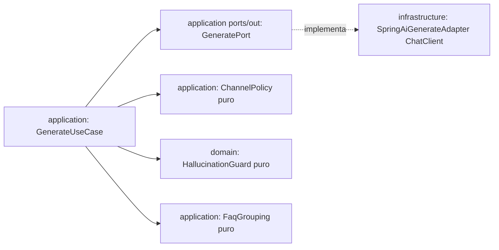

# Plan 003: Generación multicanal con Spring AI (vivo unitario + batch newsletter)

Derivado de: `spec.md RF-01..RF-06 + RNF-01..RNF-03` + `constitution.md P1-P2,R1,R4-R6,R8,Q1-Q3,Fase1`.
Consume: `ComentarioEnriquecido` de 002 (`#Listen` only). Proveedor: **OpenAI único vía Spring AI** (mismo `spring-ai-starter-model-openai` de 002). Vivo: solo `LINKEDIN/X/FAQ simple` por mensaje; `Newsletter/FAQ consolidado` va por job batch (004).

## 1. Arquitectura y componentes (hexagonal estricto)

* `domain/`: `Activo{id, sourceCommentIds[], channel: LINKEDIN|X|NEWSLETTER|FAQ, title?, copy, hashtags?, cta?, promptVersion}`, `Channel{LINKEDIN,X,NEWSLETTER,FAQ}`, `HallucinationGuard` puro (lista negra: si fuente no contiene empresa/salario/fecha/métrica, la salida tampoco; verificación por `contains` normalizado, sin LLM). Sin Spring/JPA/Lombok-lógica (R3).
* `application/`: `ports/in/GenerateUseCase`, `ports/out/GeneratePort`, `services/GenerateService` (vivo por mensaje: filtra `relevance<60` → sin LinkedIn/X; `DUDA` solo FAQ simple `fuentes:[ese id]`; si `assets[]` vacío o `DRAFT_EMPTY` → **no guardar, abort sin OCI/SSE**, solo `LOG + ⚠️`). `ChannelPolicy` puro + `FaqGrouping` puro (consolidado solo batch). Sin `@Controller,@Entity,SDKs`.
* `infrastructure/`: `SpringAiGenerateAdapter` tras `GeneratePort` con Spring AI real: `ChatClient` por canal vivo (`LINKEDIN/X/FAQ simple`, prompts `v1`, temp `0.3-0.5` redacción / `0.1` factual) + prompt `newsletter` batch, structured-output + `timeout 15s + 1 reintento + fallback DRAFT_EMPTY`, nunca `500`. Solo `text+topics+type` al LLM, nunca `author/ids/channel`.
* `interfaces/`: `GenerateController POST /api/v1/generate → 200 {assets,promptVersion} / 207` (se expone en 004). Sin lógica.

Contrato interno: entrada `ComentarioEnriquecido` unitario → salida `Activo[]` (`LINKEDIN/X/FAQ simple`) o vacío → abort. `Newsletter` (`10 msgs, ≥3 temas`) y `FAQ consolidado` (`3 dudas mismo topic`) solo por job batch con N paquetes OCI, no en vivo.

## 2. Decisiones técnicas y trade-offs

* Decisión: Spring AI real (`ChatClient` + `BeanOutputConverter` por canal) en `infrastructure/`, reutilizando dependencia/BOM de 002.
  Alternativa descartada: `RestClient` manual o plantillas string sin schema.
  Razón: misma razón que 002 (salida JSON validable RNF-01 ≥99%, reintento tipado, modelo por env) + 4 tonos versionados auditables (RNF-02/RNF-03). No añade dependencia nueva, solo adapter nuevo tras `GeneratePort` (P2).
* Decisión: `ChannelPolicy + HallucinationGuard + FaqGrouping` como negocio puro en `domain/application`, fuera del prompt.
  Alternativa descartada: dejar longitudes/anti-alucinación solo al prompt libre.
  Razón: RF-05/RF-06 son reglas de negocio verificables en tests sin LLM (Q1 ≥80%); el prompt puede fallar, la guarda no.
* Decisión: filtrado duro `relevance<60` en `GenerateService` antes de llamar al LLM (ahorro coste).
  Alternativa descartada: generar y descartar después.
  Razón: RNF coste MVP + latencia; `DUDA` con `relevance<60` solo evalúa FAQ.
* Decisión: `promptVersion:v1` único para los 4 canales esta semana (no `v1-linkedin`, etc.).
  Alternativa descartada: versionado por canal.
  Razón: simplicidad demo; trazabilidad mínima jurado (RNF-02). Versionado fino en Fase >1.
* Decisión: Discord-only; Telegram fuera.
  Alternativa: multifuente.
  Razón: foco pipeline Discord→OCI→Frontend con 2 devs.

## 3. Estrategia de pruebas

* `domain`: unit `ChannelPolicyTest` (LinkedIn `80..600+2..5 tags`, X `<=280+1..2 tags`, Newsletter `100..400 palabras+3..5 destacados`, FAQ `50..250 palabras`), unit `HallucinationGuardTest` (fuente sin empresa/salario/fecha → salida sin esos tokens; lista negra pasa).
* `application`: unit `GenerateServiceTest` con `GeneratePort` fake (unitario: `relevance=20` → sin LinkedIn/X; `DUDA` → FAQ simple 1 id; vacío/`DRAFT_EMPTY` → abort sin guardar; batch: 3 dudas mismo topic → 1 FAQ con 3 ids).
* `infrastructure`: `SpringAiGenerateAdapterTest` con `ChatClient` mockeado (schema inválido → 1 reintento → `DRAFT_EMPTY`; sin key → degradado).
* Meta Q1: ≥80% `domain+application` (JaCoCo cuando se añada).

## 4. Seguridad básica Q3 + RNF + config

`OPENAI_API_KEY,OPENAI_MODEL` solo env (reúso 002, R4). Sin PII al LLM (solo `text+topics+type`, nunca `author/ids`; buckets OCI sin PII en logs, solo `batchId/assetsCount`). Prompts `v1` en `infrastructure/prompts/` versionados, sin secretos. Límite resto API `10MB` (Q3, se aplica en 004).

## 5. Verificación

* `./mvnw test -Dtest=*Generate*,*ChannelPolicy*,*Hallucination*`
* `./mvnw test` verde obligatorio antes de PR.
* Demo: `POST /api/v1/generate` con 1 `LOGRO relevance>=70` → LinkedIn+X con hashtags+CTA sin empresa inventada; `relevance=20` → sin LinkedIn/X.
