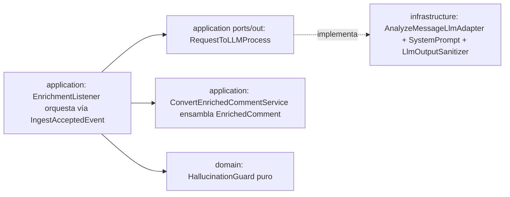

# Plan 003: Generación multicanal con Spring AI (vivo unitario + batch newsletter)

Derivado de: `spec.md RF-01..RF-06 + RNF-01..RNF-03` + `constitution.md v1.3-openai-contract, P1-P2,R1,R4-R6,R8,Q1-Q3,Fase1`.
Consume: `EnrichedComment` de 002 (`#Listen` only). Proveedor: **contrato API OpenAI vía Spring AI** (mismo `spring-ai-starter-model-openai` de 002, vendor-agnóstico, `MODEL_MISTRAL` + `BASE_URL_MODEL_AI` requerido). Vivo: solo `LINKEDIN/X/FAQ` por mensaje (1 duda o queja = 1 post FAQ, sin consolidado); `Newsletter` va por job batch (004).

## 1. Arquitectura y componentes (hexagonal estricto)

```mermaid
flowchart LR
  L[application: EnrichmentListener orquesta vía IngestAcceptedEvent] --> AP[application ports/out: RequestToLLMProcess]
  AP -.implementa.-> SAI[infrastructure: AnalyzeMessageLlmAdapter + SystemPrompt + LlmOutputSanitizer]
  L --> CV[application: ConvertEnrichedCommentService ensambla EnrichedComment]
  L --> HG[domain: HallucinationGuard puro]
```

* `domain/`: Asset (ver glosario spec §4) materializado como campos de post en `ResponseModel`/`EnrichedComment` (`channelPost/titlePost/outputContentProcessed/hashtags/cta`), `Channels{LINKEDIN,X,NEWSLETTER,FAQ}`, `HallucinationGuard` puro (lista negra: si fuente no contiene empresa/salario/fecha/métrica, la salida tampoco; verificación por `contains` normalizado, sin LLM). Split 2026-09-29: wire LLM `messageAuthor/outputContentProcessed` + interno `messageBatchId` + SSE `ResponseClient`. Sin Spring/JPA/Lombok-lógica (R3).
* `application/`: la generación no es un módulo separado: vive fusionada en el pipeline de análisis. `ports/out/RequestToLLMProcess` (puerto único LLM), `services/ai/EnrichmentListener` (orquesta por evento `IngestAcceptedEvent`: LLM → `HallucinationGuard` → validación de post → publish `ResponseClient` + buffer `EnrichedComment`; fallo LLM → flag `LLM_FALLBACK` bufferizado, abort sin OCI/SSE, solo `LOG + ⚠️`; post inválido → descarte con LOG), `services/comment/ConvertEnrichedCommentService` (ensambla `EnrichedComment` con los campos de post + `RelevancePolicy.score`) + `dtos/ResponseClient` (contrato SSE). La política de canal (LINKEDIN/X/FAQ, sin `FaqGrouping`: cada duda o queja va a su propio post) vive como reglas del prompt (ver `infrastructure`). Sin `@Controller,@Entity,SDKs`.
* `infrastructure/`: `AnalyzeMessageLlmAdapter` tras `RequestToLLMProcess` con Spring AI real: **un único prompt** `SystemPrompt.systemPromptRedactPost()` (`v1`, temp baja) que elige canal (`LINKEDIN/X/FAQ`; NEWSLETTER batch-only, 004) y declara reglas de redacción por canal (LinkedIn `80..600`+`2..5` hashtags+cta, X `<=280`+`1..2`, FAQ `outputContentProcessed 20..500`+titlePost obligatorio+cta null; preguntas/quejas PROHIBIDAS en X/LinkedIn) + `LlmOutputSanitizer` (higiene wire-format) + `timeout 15s + 1 reintento + fallback LLM_FALLBACK`, nunca `500`. Solo `text+type` al LLM, nunca `author/ids/channel`.
* `infrastructure/adapters/in/web/`: sin controller de generación. La generación es interna (orquestada por `EnrichmentListener` tras `IngestAcceptedEvent`); la API solo expone `GET /api/v1/discord/messages`. Sin lógica en web.

Contrato interno: entrada `Comment` unitario por evento → salida `EnrichedComment` con campos de post (`LINKEDIN/X/FAQ`) + `ResponseClient` para SSE o `LLM_FALLBACK` → buffer, abort sin OCI/SSE. `Newsletter` (`10 msgs, ≥3 temas`) solo por job batch con N paquetes OCI, no en vivo. FAQ sin consolidado: 1 duda o queja = 1 post.

## 2. Decisiones técnicas y trade-offs

* Decisión: Spring AI real (`ChatClient` + `BeanOutputConverter`) en `infrastructure/`, reutilizando dependencia/BOM de 002 a través del adapter único `AnalyzeMessageLlmAdapter` (fusión con 002, single-LLM-call).
  Alternativa descartada: `RestClient` manual o plantillas string sin schema; adapter separado de generación con 4 prompts.
  Razón: misma razón que 002 (salida JSON validable RNF-01 ≥99%, reintento tipado, modelo por env) + un solo prompt `v1` auditable con elección de canal (RNF-02/RNF-03) + una única llamada LLM por mensaje (coste/latencia). No añade dependencia nueva.
* Decisión (alineada 2026-09-28): reglas de canal (`LINKEDIN/X/FAQ`, longitudes, hashtags, cta, prohibición preguntas/quejas en X/LinkedIn) declaradas en `SystemPrompt` + verificación post-hoc en `EnrichmentListener` (post inválido se descarta) y `HallucinationGuard` por código. No existe clase `ChannelPolicy` dedicada.
  Alternativa descartada: política de canal como clase pura independiente del prompt.
  Razón: la elección de canal requiere entender el contenido; el LLM ya lo clasifica en la misma llamada. La capa código conserva lo determinista y verificable sin LLM (Guard, longitudes mínimas de post) — Q1 ≥80% se mantiene con `HallucinationGuardTest`/`RelevancePolicyTest`.
* Decisión (enmienda 2026-09-28): **se elimina el filtro duro `relevance<60`** (antes spec RF-06).
  Alternativa descartada: mantener umbral con degradación a FAQ para `DUDA`/`QUEJA` y descarte del resto.
  Razón: el `relevance` es una estimación no calibrada del LLM ("estimación de importancia", sin rúbrica); en la práctica las preguntas reales puntúan alto (≈95) y superarían el corte, haciendo el umbral redundante e impredecible. La protección de preguntas/quejas ya vive en las reglas de canal del prompt (RF-04); el relevance queda informativo (spec 002 §4).
* Decisión: `promptVersion:v1` único para los 4 canales esta semana (no `v1-linkedin`, etc.).
  Alternativa descartada: versionado por canal.
  Razón: simplicidad demo; trazabilidad mínima jurado (RNF-02). Versionado fino en Fase >1.
* Decisión: Discord-only; Telegram fuera.
  Alternativa: multifuente.
  Razón: foco pipeline Discord→OCI→Frontend con 2 devs.
* Decisión (enmienda menor 2026-09-28): FAQ como pregunta curada, nunca respuesta; 1 duda o queja = 1 post; preguntas y quejas jamás en X/LinkedIn; muere `FaqGrouping` consolidado.
  Alternativa descartada: canal nuevo `QUESTIONS` separado, o mantener FAQ didáctico con respuestas generadas.
  Razón: el alcance real es recolectar → procesar → redactar, nunca responder; reutilizar el `FAQ` existente evita una enmienda R8 y conserva el contrato de 4 canales. Validación FAQ: `outputContentProcessed 20..500 chars + titlePost obligatorio + cta null + hashtags 0..5`.

## 3. Estrategia de pruebas

* `domain`: unit `HallucinationGuardTest` (fuente sin empresa/salario/fecha → salida sin esos tokens; lista negra pasa; traza `LLM_FALLBACK` aprobada como registro auditable), unit `RelevancePolicyTest` (LOGRO>DUDA, <15 chars, pisos/topes).
* `application`: unit `SystemPromptTest` (reglas de canal del prompt `v1`: DUDA/QUEJA/pregunta → FAQ, longitudes por canal, NEWSLETTER batch-only) + `EnrichedCommentTest` (fallback, campos de post) + `EnrichmentListenerTest` (evento sin mensaje/vacío → descarte; flujo válido → publish `ResponseClient` antes de buffer `EnrichedComment`; fallo LLM → traza `LLM_FALLBACK` publicada y bufferizada sin `500`; Guard bloquea → sin salida; post inválido → descarte silencioso; fallback con outputContentProcessed vacío pasa por flag-first). No existe `ChannelPolicy` ni `GenerateService` (ver §2).
* `infrastructure`: `AnalyzeMessageLlmAdapterTest` con `ChatClient` mockeado (schema inválido → 1 reintento → throw → `LLM_FALLBACK` en listener; sin key → degradado `LLM_NOT_CONFIGURED`), unit `LlmOutputSanitizerTest` (cercas, preámbulo/epílogo, recorte balanceado).
* Meta Q1: ≥80% `domain+application` (JaCoCo cuando se añada).

## 4. Seguridad básica Q3 + RNF + config

`API_KEY_LLM_MISTRAL_DEV,MODEL_MISTRAL,BASE_URL_MODEL_AI` solo env (reúso 002, R4). Sin PII al LLM (solo `text+type`, nunca `author/ids`; buckets OCI sin PII en logs, solo `batchId/assetsCount`). Prompt `v1` versionado como clase `SystemPrompt` en `infrastructure/dto/ai/` (constante `EnrichedComment.PROMPT_VERSION`), sin secretos. Límite resto API `10MB` (Q3, se aplica en 004).

## 5. Verificación

* `./mvnw test -Dtest=*Analyze*,*Sanitizer*,*SystemPrompt*,*EnrichedComment*,*Relevance*,*Hallucination*`
* `./mvnw test` verde obligatorio antes de PR.
* Demo interna (sin HTTP): 1 `LOGRO` positivo → post LinkedIn con hashtags+CTA sin empresa inventada; `DUDA`/pregunta → post FAQ curado, nunca X/LinkedIn (regla de prompt). Lo verificado sale por `GET /api/v1/discord/messages` (004).
