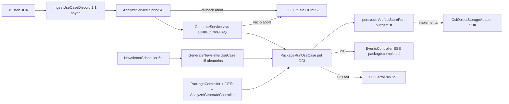

# Plan 004: Paquete OCI SDK real + SSE + GETs + newsletter batch

Derivado de: `spec.md RF-01..RF-09 (SSE requerido, RF-08 GETs, RF-09 newsletter)` + `constitution.md R1,R4-R6,Q3-Q4,Fase1`.
Alcance semanal: solo `DISCORD #Listen` por ID → `Bot → LLM (002) → etiquetas (003) → OCI → SSE` `1:1 async`, `health` + Swagger + seguridad. Solo backend habla OCI; frontend vía SSE + GETs.

## 1. Arquitectura y componentes

* `domain`: `PaqueteDeActivos{batchId=uuid 1:1 o newsletter-{fecha}, generatedAt, source:DISCORD, assets: vivo LINKEDIN/X/FAQ simple, stats, promptVersion, packageUrl?}`. Anónimo total. `<1MB application/json`.
* `application`: `ports/in/PackageRunUseCase + GenerateNewsletterUseCase + ports/out/ArtifactStorePort(put/get/list)`, `services/PackageRunService` (vivo `1:1 async`: `LLM_FALLBACK`/vacío/`DRAFT_EMPTY` → abort sin guardar; OCI-fail → `LOG` sin SSE; éxito → `201 + SSE` con lo guardado) y `GenerateNewsletterService` (sorteo puro 15 aleatorios, `≥3 temas`, abort si `<15`/fallback). Idempotencia `deduped:true`.
* `infrastructure`: `OciObjectStorageAdapter` SDK `putObject/getObject/listObjects` con keys `paquetes/paquete-{batchId}.json` y `paquetes/newsletter-{fecha}.json`, `Content-Type: application/json`. `OciConfig` env `OCI_BUCKET,OCI_REGION,NAMESPACE/AUTH` (valores dev cuenta), `NewsletterScheduler (@Scheduler cron=${NEWSLETTER_CRON:0 0 0 */5 * *}, enabled=true solo prod)` + `OciConfig` degradado `OCI_NOT_CONFIGURED`.
* `interfaces`: `PackageController POST /packages:run + POST /packages:newsletter (manual) + GET /packages + GET /packages/{batchId}` + `Analyze/GenerateController` + `EventsController SSE GET /events {type,batchId,payload: lo guardado}` con `Last-Event-ID` + `GET /actuator/health → UP` + Swagger (6 + SSE, sin ingest).

## 2. Decisiones técnicas y trade-offs

* Decisión: añadir `com.oracle.oci.sdk:oci-java-sdk-objectstorage` **esta semana** con `OciObjectStorageAdapter` real (`put/get/list`) tras `ArtifactStorePort`.
  Alternativa descartada: `InMemory/FileSystem` placeholder.
  Razón: pipeline funcional `#Listen→OCI→SSE/GETs` sin deuda; SDK en tabla constitucional → sin enmienda; tests mockean cliente.
* Decisión: añadir `spring-boot-starter-actuator` + `springdoc-openapi-starter-webmvc-ui` ahora.
  Alternativa: health/Swagger manuales.
  Razón: tabla cerrada `a añadir`, P3/Q4. Resto actuadores cerrados (`health,info` solo).
* Decisión: SSE requerido con lo guardado + `GETs` recuperación (solo backend habla OCI).
  Alternativa: solo REST sin SSE.
  Razón: cada registro se envía por SSE; si frontend cae recupera por `GET /packages`. Fallos OCI/LLM solo `LOG`, sin SSE.
* Decisión: newsletter batch `@Scheduler` cada 5 días prod (`NEWSLETTER_BATCH_SIZE=15`, sorteo aleatorio OCI, abort si `<15`/fallback) + `POST manual` para demo.
  Alternativa: newsletter en vivo por mensaje.
  Razón: `RF-03` exige N + `≥3 temas`, imposible `1:1`; batch separado sin bloquear vivo.

## 3. Estrategia de pruebas

* Unit `PackageRunService` (vivo: `LLM_FALLBACK`/vacío → abort sin put; OCI-fail → `LOG` sin SSE; éxito → `201 + SSE`; mismo `batchId` → `deduped:true`).
* Unit `GenerateNewsletterService` (sorteo 15 aleatorios puro; `<15` → abort; `≥3 temas`; fallback → abort).
* Adapter `OciObjectStorageAdapterTest` mockeado: `put/get/list`, `<1MB` + `Content-Type`, keys `paquete-`/`newsletter-`, re-put → `deduped:true`, sin creds → `OCI_NOT_CONFIGURED`.
* `webmvc-test`: `PackageControllerTest` (`:run`, `:newsletter`, `GETs` 200, SSE `package.completed`), `HealthTest` UP. Scheduler `enabled=false` en test.
* Seguridad: CORS, 400 problema, sin stacktraces/PII.

## 4. Verificación

* `./mvnw test -Dtest=*Package*,*Newsletter*,*Events*,*Health*`
* `./mvnw spring-boot:run` → `#Listen` → `201 + ✅ + SSE`; fallback/vacío/OCI-fail → `LOG + ⚠️` sin SSE; `GET /packages` recupera; `POST /packages:newsletter` con ≥15 genera newsletter. Telegram fuera.
