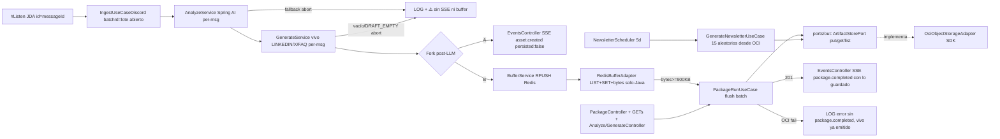

# Plan 004: Paquete OCI batch + buffer Redis por tamaño + fork SSE vivo + GETs + newsletter batch

Derivado de: `spec.md RF-01..RF-09 (fork SSE+buffer, SSE doble, RF-08 GETs persistido, RF-09 newsletter 2º nivel)` + `constitution.md v1.2-redis-buffer R1,R4-R6,Q3-Q4,Fase1`.
Alcance semanal: solo `DISCORD #Listen` por ID → `Bot → LLM por mensaje (002) → etiquetas (003) → fork: SSE inmediato asset.created + buffer Redis por bytes → flush OCI batch → SSE package.completed` `N:1`, `health` + Swagger + seguridad. Solo backend habla OCI/Redis; frontend vía SSE doble + GETs persistidos.

## 1. Arquitectura y componentes

* `domain`: `AssetPackage{batchId=uuid lote Redis o newsletter-{fecha}, generatedAt, source:DISCORD, assets: vivo LINKEDIN/X/FAQ simple de N mensajes, stats{received=N, analyzed=N, fallbackCount, assetsCount=N}, promptVersion, packageUrl?}`. Anónimo total (solo `messageId/batchId/source` en logs). `<1MB application/json`, threshold buffer `900KB`.
* `application`: `ports/in/PackageRunUseCase + GenerateNewsletterUseCase + ports/out/ArtifactStorePort(put/get/list) + ports/out/BufferPort(getCurrentBatchId, append, flushIfNeeded)`, `services/BufferService` (solo Java sin Lua: `SADD ids messageId` dedup → `RPUSH list json procesado` → `INCRBY bytes len` → si `>=900KB` flush `synchronized`: `LRANGE` → envuelve `LIST` JSONs en `assets[]` → `put OCI paquete-{batchId lote}.json` → `SSE package.completed` → `DEL + nuevo uuid lote`; `LLM_FALLBACK`/vacío nunca entra al buffer) y `GenerateNewsletterService` (sorteo puro 15 aleatorios desde OCI, `≥3 temas`, abort si `<15`/fallback). Idempotencia doble: `messageId` en buffer + `deduped:true` por `batchId` lote en OCI.
* `infrastructure`: `RedisBufferAdapter` (`spring-data-redis` `RedisTemplate<String,String>`: keys `buffer:current:id/list/ids/bytes`, `Docker` local / `OCI Cache` prod, env `REDIS_HOST/PORT + REDIS_BUFFER_MAX_BYTES=921600`, degradado `REDIS_NOT_CONFIGURED` → sin buffer pero con SSE vivo) + `OciObjectStorageAdapter` SDK `putObject/getObject/listObjects` con keys `paquetes/paquete-{batchId lote}.json` y `paquetes/newsletter-{fecha}.json`, `Content-Type: application/json`. `OciConfig` env `OCI_BUCKET,OCI_REGION,NAMESPACE/AUTH` (valores dev cuenta), `NewsletterScheduler (@Scheduler cron=${NEWSLETTER_CRON:0 0 0 */5 * *}, enabled=true solo prod)` + `OciConfig` degradado `OCI_NOT_CONFIGURED`.
* `interfaces`: `PackageController POST /packages:run (flush manual) + POST /packages:newsletter (manual) + GET /packages + GET /packages/{batchId lote}` + `Analyze/GenerateController` + `EventsController SSE GET /events`: `asset.created {messageId, batchId-abierto, persisted:false}` inmediato + `package.completed {batchId lote, packageUrl}` con lo guardado, con `Last-Event-ID` + `GET /actuator/health → UP` + Swagger (6 + SSE doble, sin ingest).

## 2. Decisiones técnicas y trade-offs

* Decisión: Redis buffer por tamaño (`spring-data-redis`, solo Java sin Lua) como contenedor lote.
  Alternativa descartada: `1:1 directo a OCI` (1 mensaje = 1 paquete).
  Razón: agrupar N mensajes procesados en 1 objeto `<1MB` abarata PUTs OCI + `package.completed`; el fork `SSE inmediato` mantiene UX realtime sin esperar al flush. Requiere enmienda (Redis fuera de tabla v1.1, ya en constitución v1.2).
* Decisión: threshold `REDIS_BUFFER_MAX_BYTES=921600 (900KB)` óptimo bajo 1MB.
  Alternativa descartada: count fijo N o memoria Redis `MEMORY USAGE`.
  Razón: bytes JSON acumulados (`INCRBY len`) predicen el tamaño final OCI; 900KB deja ~100KB margen envelope; count/memoria no garantizan `<1MB`.
* Decisión: estructura `LIST (RPUSH json) + SET (SADD messageId dedup) + STRING bytes + STRING current:id`, solo `RedisTemplate/ListOps/SetOps` Java, `synchronized` en `flushIfNeeded`, sin Lua.
  Alternativa descartada: `HASH` por messageId, `STREAM` con consumer groups, scripts Lua atómicos.
  Razón: `LIST` es la envoltura válida de JSONs pedida (`LRANGE` → `assets[]`); `SET` da dedup idempotente; sin Lua por simplicidad MVP 2 devs (petición explícita).
* Decisión: fork post-LLM `A) asset.created inmediato (persisted:false) + B) RPUSH buffer`.
  Alternativa descartada: solo SSE con lo guardado (modelo anterior).
  Razón: el mensaje procesado va directo a lista Redis y a la vez al frontend; `package.completed` sigue solo con lo guardado para trazabilidad OCI.
* Decisión: añadir `com.oracle.oci.sdk:oci-java-sdk-objectstorage` **esta semana** con `OciObjectStorageAdapter` real (`put/get/list`) tras `ArtifactStorePort`.
  Alternativa descartada: `InMemory/FileSystem` placeholder.
  Razón: pipeline funcional `#Listen→OCI→SSE/GETs` sin deuda; SDK en tabla constitucional → sin enmienda; tests mockean cliente.
* Decisión: añadir `spring-boot-starter-actuator` + `springdoc-openapi-starter-webmvc-ui` ahora.
  Alternativa: health/Swagger manuales.
  Razón: tabla cerrada `a añadir`, P3/Q4. Resto actuadores cerrados (`health,info` solo).
* Decisión: SSE doble requerido (`asset.created` vivo + `package.completed` guardado) + `GETs` recuperación solo persistido (solo backend habla OCI/Redis).
  Alternativa: solo REST sin SSE.
  Razón: cada procesado se envía vivo por SSE; cada batch guardado se envía + es recuperable por `GET /packages`. Fallos LLM solo `LOG` sin SSE ni buffer; fallos OCI solo `LOG` sin `package.completed` (vivo ya emitido).
* Decisión: newsletter batch `@Scheduler` cada 5 días prod (`NEWSLETTER_BATCH_SIZE=15`, sorteo aleatorio OCI, abort si `<15`/fallback) + `POST manual` para demo.
  Alternativa: newsletter en vivo por mensaje.
  Razón: `RF-03` exige N + `≥3 temas`, imposible `1:1`; batch separado sin bloquear vivo.

## 3. Estrategia de pruebas

* Unit `BufferService` (dedup `messageId` → sin `RPUSH`; `bytes<900KB` → sin flush; `bytes>=900KB` → `1 PUT paquete-{batchId lote}.json + SSE package.completed + DEL + nuevo lote`; `LLM_FALLBACK`/vacío nunca entra; `synchronized` sin Lua).
* Unit `PackageRunService` (flush: éxito → `201 + SSE package.completed`; OCI-fail → `LOG` sin `package.completed` pero con `asset.created` ya emitido; mismo `batchId` lote → `deduped:true`).
* Unit `GenerateNewsletterService` (sorteo 15 aleatorios puro; `<15` → abort; `≥3 temas`; fallback → abort).
* Adapter `RedisBufferAdapterTest` mockeado (`RedisTemplate`): `SADD/RPUSH/INCRBY`, `LRANGE` envuelve `LIST` JSONs, `bytes>=900KB` dispara flush, `DEL + nuevo uuid`, sin Redis → `REDIS_NOT_CONFIGURED` con SSE vivo intacto.
* Adapter `OciObjectStorageAdapterTest` mockeado: `put/get/list`, `<1MB` + `Content-Type`, keys `paquete-{batchId lote}/newsletter-`, re-put → `deduped:true`, sin creds → `OCI_NOT_CONFIGURED`.
* `webmvc-test`: `PackageControllerTest` (`:run` flush manual, `:newsletter`, `GETs` 200 solo persistido, SSE `asset.created persisted:false + package.completed`), `HealthTest` UP. Scheduler `enabled=false` en test.
* Seguridad: CORS, 400 problema, sin stacktraces/PII.

## 4. Verificación

* `./mvnw test -Dtest=*Package*,*Buffer*,*Redis*,*Newsletter*,*Events*,*Health*`
* `./mvnw spring-boot:run` → `#Listen` → por mensaje `asset.created + RPUSH`; al llegar a `900KB` → `201 + package.completed + ✅`; fallback/vacío → `LOG + ⚠️` sin SSE ni buffer; OCI-fail flush → `LOG + ⚠️` sin `package.completed`; `GET /packages` solo persistido; `POST /packages:newsletter` con ≥15 genera newsletter. Telegram fuera. Redis local vía Docker.
