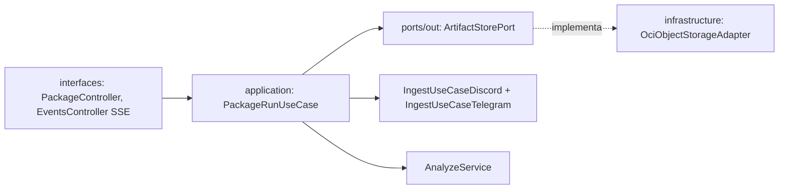

# Plan 004: Paquete OCI + transversal mínimo (health, docs, seguridad)

Derivado de: `spec.md RF-01..RF-07 (mínimo RF-01,RF-02,RF-03,RF-04,RF-05,RF-06; RF-07 SSE incluido básico)` + `constitution.md R1,R4-R6,Q3-Q4,Fase1`.
Alcance semanal: guardar mensajes Discord y Telegram (vía sus bots) como `PaqueteDeActivos` en OCI, orquestación `bot→análisis→OCI` mensaje-por-mensaje, `health` + Swagger + seguridad básica.

## 1. Arquitectura y componentes

* `domain`: `Activo{id,sourceCommentIds,channel,copy,promptVersion}`, `PaqueteDeActivos{batchId,generatedAt,source,assets,stats{received,analyzed,fallbackCount,assetsCount},promptVersion,packageUrl?}`. Esta semana `assets` puede ser vacío o con borrador mínimo si 003 no entra; el guardado persiste igual `<1MB application/json`.
* `application`: `ports/in/PackageRunUseCase`, `ports/out/ArtifactStorePort`, `services/PackageRunService` (acumula por `batchId`, idempotencia `deduped:true`, `207` si hubo fallbacks).
* `infrastructure`: `OciObjectStorageAdapter` tras `ArtifactStorePort`. Fase actual: `InMemoryArtifactStore` + `FileSystemArtifactStore` listo para OCI SDK sin tocar puertos; objeto `paquete-{batchId}.json`. Credenciales solo env `OCI_BUCKET,OCI_REGION,OCI_*_KEY`. `Content-Type: application/json`, cifrado lado OCI.
* `interfaces`: `PackageController POST /api/v1/packages:run → 201 {batchId,assetsCount,packageUrl}/207` (disparo manual demo; el flujo real lo dispara el bot), `GET /api/v1/events text/event-stream {type,batchId,payload}` con `Last-Event-ID`, `GET /actuator/health → UP p95<100ms`, Swagger `/swagger-ui.html` con 4 endpoints (sin ingest).

## 2. Decisiones técnicas y trade-offs

* Decisión: no añadir `oci-java-sdk-objectstorage` esta semana, usar puerto + adapter in-memory/filesystem con misma firma.
  Alternativa: SDK sin bucket/keys reales.
  Razón: sin `OCI_BUCKET/REGION` verificados el build demo se rompería; cambio a SDK sin tocar `domain/application` (P2). Deuda en §11.
* Decisión: añadir `spring-boot-starter-actuator` + `springdoc-openapi-starter-webmvc-ui` ahora.
  Alternativa: health/Swagger manuales.
  Razón: tabla cerrada los autoriza como `a añadir`, P3/Q4 los exigen. Resto actuadores cerrados.
* Decisión: SSE en memoria con replay por `Last-Event-ID`, mismo CORS allowlist.
  Alternativa: Redis Streams.
  Razón: $0, demo sin recargar (spec 004 RF-07 <5s).

## 3. Estrategia de pruebas

* Unit `PackageRunService` (idempotencia mismo `batchId` → 1 objeto + `deduped:true`, 207 con fallback).
* Adapter test `<1MB`, `Content-Type`, URL `oci://{bucket}/paquetes/{batchId}.json`.
* `webmvc-test`: `PackageControllerTest` 201/207, `EventsControllerTest` SSE recibe `asset.created/package.completed`, `HealthTest` UP.
* Seguridad: CORS bloquea `Origin` no permitido, 400 formato problema, sin stacktraces.

## 4. Verificación

* `./mvnw test -Dtest=*Package*,*Events*,*Health*`
* `./mvnw spring-boot:run` → `GET /actuator/health`, `/swagger-ui.html` con 4 endpoints, mensaje Discord o Telegram vía su bot → paquete `201` interno.
