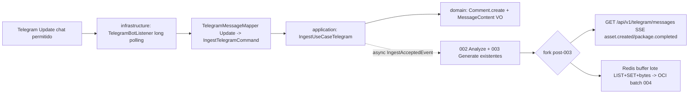

# Plan 005: Ingesta Telegram long polling + reuso pipeline + dual SSE

Derivado de: `spec.md RF-01..RF-07 + RNF-01..RNF-04` + `constitution.md v1.7-dual-get P1-P6,R1-R8,Q1-Q5` + `specs 001/002/003/004`.
Alcance: solo `TELEGRAM` long polling (backend es el bot). Sin `POST` ingesta. Secuencia: `Bot Telegram → LLM por mensaje (002) → etiquetas canal (003) → fork: SSE inmediato + buffer Redis lote por tamaño → OCI batch + frontend (004)`, `N mensajes = 1 paquete`. Redis como almacenamiento de lote volátil; OCI único persistente.

## 1. Arquitectura y componentes (hexagonal estricto)

* `domain/`: sin cambios. Records `Comment{messageId, channelId=chatId, author, content (truncado 2000+flag), truncated, sentTime, source}` + VO `MessageContent` + factory `Comment.create` + `Source{DISCORD,TELEGRAM}` existente. Sin Spring/JPA/Lombok-lógica (R3). `id=messageId` nativo Telegram (sin uuid por mensaje); `batchId` no vive en dominio, es `uuid` lote abierto Redis asignado en `application`. Sin `type` en 005 (lo clasifica IA en 002). Filtro por `chatId` fuera de dominio (en listener).
* `application/`: `ports/in/IngestUseCaseTelegram` (nuevo, espejo `IngestUseCaseDiscord`), `command/IngestTelegramCommand{messageId, channelId=chatId, authorId, authorName, content, sentTime}` (espejo `IngestDiscordCommand`), `services/comment/telegram/IngestTelegramService` (espejo `IngestDiscordService`: `Comment.create → BufferPort.getCurrentBatchId() → ChannelMessage → publish IngestAcceptedEvent → return <300ms`). Reuso total: `EnrichmentListener.on`, `RequestToLLMProcess`, `ConvertEnrichedCommentService`, `HallucinationGuard`, `RelevancePolicy`, `BufferPort.appendToBatch`, `EventPublishPost.publish`. Sin `@Controller,@Entity,SDKs`.
* `infrastructure/adapters/in/bot/`: `TelegramBotListener` (long polling `Update`, filtros `from.isBot → descarta`, `chatId != ${TELEGRAM_LISTEN_CHAT_ID} → ignora en silencio`, `texto vacío → descarta`, `>2000 → trunca`) + `TelegramMessageMapper` + `TelegramBotProperties` (`TELEGRAM_BOT_TOKEN`, opcional `TELEGRAM_BOT_USERNAME`). Sin negocio, solo adaptación. SDK Telegram solo aquí tras `IngestUseCaseTelegram` (P1/R1).
* `infrastructure/adapters/in/web/`: nuevo `GetMessagesProcessedTelegram` (espejo `GetMessagesProcessedDiscord`: `GET /api/v1/telegram/messages`, `text/event-stream`, `Last-Event-ID` replay, Swagger con ejemplo `ResponseClient{source=TELEGRAM}`). Requiere enmienda dual-get (ver §2). `SseEventPublisherAdapter` reutilizado (segunda instancia o tópico por fuente para no mezclar Discord/Telegram). Solo delega a `application`, sin negocio (R2).
* `infrastructure/adapters/out/`: sin cambios (`RedisBufferAdapter` `SADD messageId → RPUSH json EnrichedComment → INCRBY bytes`, `AnalyzeMessageLlmAdapter`, OCI batch 004). Redis sigue como lote volátil con flush `921600B`; OCI único persistente.

Contrato interno: `Update` válido → `Comment{id nativo, batchId lote}` en p95<300ms + async a `002`. Tras `002+003` fork: `SSE asset.created ResponseClient + RPUSH Redis EnrichedComment`. Bot/vacío/fuera de chat → descarte silencioso sin PII (solo `messageId,batchId,source`). `>2000 → 2000+truncated:true`. Sin `202/400/413/429` HTTP para ingesta (no hay POST).

## 2. Decisiones técnicas y trade-offs

* Decisión: long polling con `TelegramBots` en `infrastructure/`.
  Alternativa descartada: webhook con `POST /api/v1/telegram/webhook` expuesto por el backend o bot externo haciendo push a endpoint.
  Razón: por simplicidad, tiempo de desarrollo y alcance MVP (proyecto a 4 semanas). Long polling no exige URL HTTPS pública ni configuración extra de despliegue, lo que reduce riesgo y coste ($0, demo simple). El sistema está diseñado para ser escalable y la arquitectura hexagonal actual lo permite: el SDK vive solo tras el puerto de entrada, por lo que se puede reemplazar por webhook en Fase >1 sin tocar `domain/application`. Requiere enmienda menor (dependencia fuera de tabla cerrada v1.6, igual que JDA/Redis en su día).
* Decisión: truncar >2000 a 2000 con `truncated:true` uniforme con Discord.
  Alternativa descartada: aceptar 4096 nativo Telegram.
  Razón: uniformidad del dominio 1..2000 + no perder mensajes largos; la IA no penaliza por corte (ver 002).
* Decisión: nuevo `GET /api/v1/telegram/messages` SSE separado (dual-get).
  Alternativa descartada: reusar único `GET /api/v1/discord/messages` con filtro `?source=` o mismo stream multiplexado.
  Razón: aislamiento por fuente para demo y evolución independiente Discord/Telegram; UX clara por canal de origen. Enmienda ratificada en constitución `v1.7-dual-get`: `Decisión dual-get / Alternativa single-get multiplexado / Razón aislamiento demo sin romper fork existente`. Swagger documenta ambos GETs + health (P3).
* Decisión: Redis como almacenamiento de lote volátil, OCI único persistente (sin cambio).
  Alternativa descartada: Redis queryable como DB + `GET /packages` o persistencia local en disco.
  Razón: respeta constitución §2 Buffer/Storage + R6; el `GET` telegram es solo vivo SSE + replay memoria, nunca expone el buffer abierto por HTTP (igual que 004 RF-08).
* Decisión: validación pura en `domain` (factory `Comment.create` + VO `MessageContent`), sin Bean Validation HTTP para ingesta (no hay body REST).
  Alternativa descartada: DTOs con `jakarta.validation` para ingesta.
  Razón: no hay request HTTP de entrada; `validation` sigue aplicando al resto API, no a este flujo.
* Decisión: sin rate-limit en backend Fase 1.
  Alternativa descartada: rate-limit in-memory/Bucket4j/Redis con `429`.
  Razón: alcance MVP + riesgo de pérdida (un `429` puede perder mensajes sin reintentos garantizados app). Protección en filtro anti-bot + texto 1..2000 + validación estricta.
* Decisión: `type=OTRO` fijo a la entrada; IA clasifica en 002.
  Alternativa descartada: inferir por prefijo/chat en 005.
  Razón: el contenido manda, clasificación es negocio IA.

## 3. Contratos de Datos / Interfaces

* Interno ingesta: `Update{messageId, chatId, from{id,name}, text, date} → IngestTelegramCommand → Comment → ChannelMessage{batchId,messageId,channelId,authorId,authorName,content,sentTime,truncated,source=TELEGRAM} → IngestAcceptedEvent`.
* Salida SSE: `ResponseClient` idéntico a Discord con `source=TELEGRAM` (ver 003 §4). `id:` evento = `messageId`.
* Buffer Redis (sin cambio): keys `buffer:current:id/list/ids/bytes`, solo Java `ListOps/SetOps`, sin Lua, flush `921600B` → OCI `paquetes/paquete-{batchId}.json`.
* Nuevo endpoint: `GET /api/v1/telegram/messages` (`Accept: text/event-stream`, header opcional `Last-Event-ID`), eventos `asset.created {ResponseClient}`, `package.completed {batchId,payload:{assets,packageUrl}}`. Sin `POST` ingesta ni `GET /packages`.

## 4. Estrategia de pruebas

* `domain`: reuso `CommentTest` (trim, truncado 2000+flag, ids/`sentTime`/`source` requeridos) — añadir caso `source=TELEGRAM` si falta.
* `application`: nuevo `IngestTelegramServiceTest` con comando fake (válido, vacío→empty, >2000→trunca, `source` propagado, `batchId` de `BufferPort` mock, publish evento).
* `infrastructure bot`: nuevo `TelegramBotListenerTest/TelegramMessageMapperTest` con `Update` fake (chatId igual/distinto, bot ignorado, vacío descartado, truncado marcado).
* `infrastructure web`: nuevo `GetMessagesProcessedTelegramTest` (`webmvc-test`, SSE 200 + `Last-Event-ID` replay, Swagger ejemplo).
* Meta Q1: ≥80% `domain+application` (JaCoCo cuando se añada). Sin Spring context salvo `webmvc-test`.

## 5. Seguridad básica Q3 + RNF + config

Token `TELEGRAM_BOT_TOKEN` (+ opcional `TELEGRAM_BOT_USERNAME`) + filtro `TELEGRAM_LISTEN_CHAT_ID` solo por env/perfil, nunca en repo (R4). Sin token → fail-fast arranque con error claro (no UP fingido). Sin PII en logs (solo `messageId,batchId,source`; `authorId` solo `DEBUG` local/test). Resto API: CORS allowlist `${CORS_ALLOWED_ORIGINS}`, headers `nosniff/DENY`, CSRF off stateless, Bean Validation resto inputs, límite `10MB` resto API. Orden validación: primero token + polling + primer `Update`, después velocidad p95.

## 6. Verificación

* `./mvnw test -Dtest=*Telegram*,*Comment*,*Ingest*`
* `./mvnw test` verde obligatorio antes de PR.
* `./mvnw spring-boot:run` con token + chat prueba → mensaje Telegram normalizado `<300ms` + `asset.created` en `GET /api/v1/telegram/messages` <5s + `RPUSH` Redis; otro chat → ignorado; `GET /actuator/health` sigue UP.
* Arranque sin token → falla rápido `Telegram token is required`, sin fingir UP.
