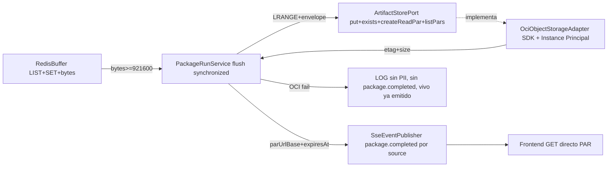

# Plan 006: Almacenamiento OCI opción A + lectura directa PAR

Derivado de: `spec.md RF-01..RF-06 + RNF-01..RNF-06` + `constitution.md v1.7-dual-get R1,R4-R6,Q3-Q4,Fase 1` + `004-paquete-oci-health RF-01/RF-02/RNF-01/RNF-02`.
Alcance: `Bot → LLM por mensaje (002) → etiquetas (003) → fork SSE vivo + RPUSH Redis (004 intacto) → flush por bytes 1 PUT → 1 CreatePAR read → SSE package.completed con URL → frontend GET directo a OCI`. Solo `DISCORD #Listen` para demo, `TELEGRAM` mismo patrón. Redis no se toca salvo completar su flush pendiente (`maxBatchSize` hoy reservado). Opción A fijada: `1 lote = 1 objeto = 1 PAR read por objeto`.

> Nota TTL: el TTL es solo de la URL PAR, no del objeto. El objeto persiste hasta borrado/lifecycle; la PAR vence y se renueva (`List + reuse`).

## 1. Arquitectura y componentes

* `domain` (puro, sin `org.springframework`/`jakarta.persistence`, R1-R3): `AssetPackage{batchId lote, generatedAt, source: DISCORD|TELEGRAM, assets: Asset[] vivo LINKEDIN/X/FAQ (1 duda = 1 post), enriched: EnrichedComment[] con authorId/authorName/channelId/messageId para trazabilidad, stats:{received, analyzed, fallbackCount, assetsCount}, promptVersion: "v1", packageUrl?}` + `PackageStats` + validación `<1048576 bytes` y `assets[]` no vacío. Dueño único 006 (`Asset` vive en 003). Anonimato solo ante el LLM; OCI conserva usuario; logs prod solo `messageId/batchId/source`.
* `application` (sin `@Controller`, sin SDKs): `ports/in PackageRunUseCase.flush(batchId)` + `ports/out ArtifactStorePort{put, exists, createReadPar, listPars}` + `ports/out BufferPort{getCurrentBatchId, append, flushIfNeeded, readBatch, rotate}` (extiende `BufferPort` actual de 2 métodos) + `services BufferService + PackageRunService` (solo Java sin Lua: `SADD ids messageId` dedup → `RPUSH list json` → `INCRBY bytes len` → si `>=900KB` flush `synchronized`: `LRANGE` → envuelve en `assets[]` → `put paquete-{batchId}.json` → `exists? deduped:true` → `listPars? reuse deduped:true : create` → `SSE package.completed` → `DEL + nuevo uuid lote`; `LLM_FALLBACK` entra como traza auditable, vacío/post-inválido aborta sin OCI).
* `infrastructure` (adapters implementan ports, P2): `OciObjectStorageAdapter` (único que toca SDK: `PutObject + GetNamespace auto + CreatePreauthenticatedRequest ObjectRead + ListPreauthenticatedRequests` solo en re-flush) + `OciConfig` (`InstancePrincipalsAuthenticationDetailsProvider` en prod, bean desactivado en local/test → `OCI_NOT_CONFIGURED` con SSE vivo intacto, mismo patrón que `REDIS_NOT_CONFIGURED`) + `RedisBufferAdapter` completado (`LRANGE/DEL/nuevo uuid`; hoy sin flush) + `SseEventPublisherAdapter` extendido a `package.completed {type, batchId, payload:{assetsCount, parUrlBase, expiresAt}}` por `source` (dual-get, `Last-Event-ID` replay intacto).
* `infrastructure/adapters/in/web`: `GetMessagesProcessedDiscord + GetMessageProcessedTelegram` existentes emiten `asset.created` + `package.completed` por su stream; `GET /actuator/health -> UP`; Swagger solo `GET SSE + health`, sin `GET /packages*` (004 RF-08 sigue: lectura histórica es frontend→OCI, no frontend→backend).
* `config / despliegue`: base `application.yaml` solo no-secretos `${OCI_BUCKET/OCI_REGION/OCI_NAMESPACE/OCI_PREFIX:paquetes//PAR_TTL_DAYS:7/REDIS_BUFFER_MAX_BYTES:921600}`; `application-prod.yaml` mismos keys con valores OCI reales; nunca `.env/*-local.yaml/*.pem/*.key/token*.json/.oci/` (R4). Docker en VM permite egress a `169.254.169.254` + `objectstorage.{region}.oraclecloud.com`.
* `IAM (propuesta + TBD cuenta §6 spec)`: `dynamic-group communitylab-vm` + `Allow dynamic-group to manage objects in compartment where target.bucket.name='communitylab-assets'` recortado a `OBJECT_CREATE + OBJECT_OVERWRITE + PAR_MANAGE (+ OBJECT_READ solo para otorgar PAR read, sin Get/List en negocio)`; región propuesta `sa-saopaulo-1`.

## 2. Contratos de Datos / Interfaces

* Key: `paquetes/paquete-{batchId lote}.json`, `Content-Type: application/json`, `<1MB`, cifrado OCI default Always Free.
* `ArtifactStorePort`: `put(key,bytes)->{etag,sizeBytes}`, `exists(key)->bool`, `createReadPar(object,ttlDays)->{parUrl,expiresAt}`, `listPars(bucket)->[{parId,object,expiresAt}]` (solo re-flush para `deduped:true`, no en path caliente).
* SSE: `{type:"package.completed", batchId, payload:{assetsCount:N, parUrlBase:"https://...", expiresAt:"ISO-8601"}}`, `id=batchId`, sin contenido ni PII ni PAR en logs. Fallo OCI → sin evento.
* Re-flush mismo `batchId`: objeto existe → `deduped:true` sin re-PUT; PAR vigente existe → `deduped:true` sin `CreatePAR`.
* Env: `OCI_BUCKET`, `OCI_REGION`, `OCI_NAMESPACE`, `OCI_PREFIX=paquetes/`, `PAR_TTL_DAYS=7`, `REDIS_BUFFER_MAX_BYTES=921600`, `REDIS_HOST/PORT`.

## 3. Decisiones técnicas y trade-offs

* Decisión: añadir `com.oracle.oci.sdk:oci-java-sdk-objectstorage` tras `ArtifactStorePort`.
  Alternativa descartada: REST manual / CLI / placeholder `InMemory/FileSystem`.
  Razón: en tabla constitucional Storage; `Put + CreatePAR + ListPARs` sin deuda; tests mockean cliente. Requiere verificar compatibilidad `Boot 4.1.1 + Java 21` en `TASK-006-00`.
* Decisión: `InstancePrincipalsAuthenticationDetailsProvider` transparente en prod, degradado `OCI_NOT_CONFIGURED` en local/test.
  Alternativa descartada: API Key con `OCI_*_KEY` en env.
  Razón: mismo ecosistema VM + bucket, cero secretos/rotación/brechas de config; no tumba SSE vivo en local.
* Decisión: 1 PAR read por objeto/lote, sin `listing enabled`.
  Alternativa descartada: PAR por asset interno, PAR global `paquetes/`, PAR por prefijo con list (opción B).
  Razón: `N lotes = N PUTs + N PARs` (mínimo en opción A); blast-radius por lote revocable; sin `ListObjects` para leer.
* Decisión: `List + reuse` solo en re-flush para `deduped:true`.
  Alternativa descartada: crear siempre nueva o cache local en memoria/Redis.
  Razón: 1 llamada extra solo en idempotencia, no en path caliente; fuente de verdad OCI (cache local se pierde al reiniciar).
* Decisión: flush `synchronized` sin Lua, hereda 004.
  Alternativa descartada: scripts Lua atómicos, `STREAM`/consumer groups, `HASH` por messageId.
  Razón: simplicidad MVP; `LIST` es la envoltura válida (`LRANGE → assets[]`); `SET` da dedup; doble flush cubierto por `exists + deduped:true`.
* Decisión: PAR TTL explícito `7d`, no editable (crear nueva + revocar anterior).
  Alternativa descartada: TTL largo implícito o sin expiración.
  Razón: Q3 + rotación por lote; el objeto persiste aunque la PAR expire; prohibido borrar bucket con PARs asociadas.

## 4. Estrategia de pruebas y despliegue

* Unit `AssetPackageTest` (`<1MB`, `assets[]` vacío aborta, `relevance clamp 0..100`, `topics/hashtags null→[]`).
* Unit `BufferServiceTest, PackageRunServiceTest` con puertos mockeados (Mockito solo en boundaries): dedup `messageId` sin `RPUSH/INCRBY`; `bytes<900KB` sin flush; `>=900KB` → `1 PUT + 1 PAR + SSE + DEL + nuevo uuid`; `OCI-fail` → `LOG` sin `package.completed` con vivo ya emitido; re-`batchId` → `deduped:true` sin re-PUT ni `CreatePAR`.
* Adapter `OciObjectStorageAdapterTest` mockeado (cliente SDK): `put/create/list`, `Content-Type`, keys `paquete-{batchId}`, re-put → `deduped:true`, sin creds → `OCI_NOT_CONFIGURED`.
* Adapter `RedisBufferAdapterTest` mockeado (`RedisTemplate`): `SADD/RPUSH/INCRBY/LRANGE`, `DEL + nuevo uuid`, sin Redis → degradado con SSE intacto.
* `webmvc-test`: `package.completed` por `source` con `Last-Event-ID` replay (`GetMessagesProcessedDiscordTest`, `GetMessageProcessedTelegramTest`), `HealthTest UP`, `SwaggerDocsTest` (solo `GET SSE + health`). Scheduler `enabled=false` en test. Sin PII/PAR en logs.
* Despliegue: Redis local vía `docker-compose-dev.yaml`; prod VM OCI misma región/compartment que bucket; IAM dynamic-group + políticas antes del primer flush; `sdd-audit` obligatorio antes de codificar.

## 5. Verificación

* `./mvnw test -Dtest=*Package*,*Buffer*,*Oci*,*Par*,*Events*,*Health*`
* `./mvnw spring-boot:run` → por mensaje `asset.created + RPUSH`; a `900KB` → flush + `package.completed {batchId, parUrlBase, expiresAt} + ✅` por SSE de su `source`; `GET parUrlBase → 200 application/json`; re-flush mismo `batchId` → `deduped:true`; OCI-caído → `LOG + ⚠️` sin `package.completed`; sin `GET /packages*`; Redis local vía Docker.
