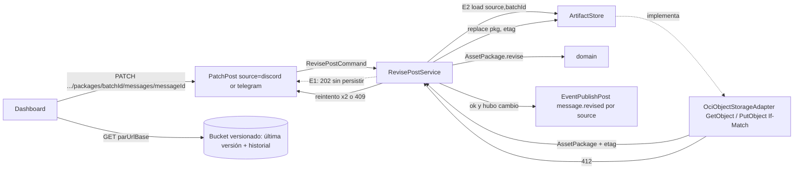

# Plan 007: Aprobación y edición versionada de posts

Derivado de: `spec.md RF-01..RF-09 + RNF-01..RNF-05` + `constitution.md v1.9-revision-versionada P1-P3,R1-R6,Q1-Q3` + `006 RF-02/RF-03/RF-05,§4 + plan 006 §1.1,§2`.
Alcance final: `PATCH por fuente → RevisePostService (lock optimista) → ArtifactStore load (GetObject + etag) → AssetPackage.revise → ArtifactStore replace (PutObject If-Match) → SSE message.revised`. El flush de 006 no cambia: sigue create-only (`If-None-Match: *`) y con Object Versioning activo un re-flush sigue dando `412 → alreadyStored`, nunca pisa un paquete revisado.
Entregas: **E1 (2026-10-09)** = §1.1 (atributos + endpoint que recibe y valida, `202`). **E2** = §1.2 (guardado en OCI, generación de `versionMessage`, concurrencia, SSE). E1 no toca `ArtifactStore`, OCI ni el SSE.

## 1. Arquitectura y componentes



### 1.1 E1 — atributos y endpoint (hoy)

* `domain` (R1/R3, sin Spring ni Jackson):
  * `EnrichedComment` + 2 componentes al final del record: `Boolean approved`, `Integer versionMessage` (sin `editedAt`, spec RF-01). Compact constructor: `approved == null → false`; `versionMessage == null || < 1 → 1`. `ConvertEnrichedCommentService` construye con `false, 1` (salida de la IA).
    * **Por qué wrappers y no `boolean/int`** (verificado 2026-10-09 contra el `ObjectMapper` de Boot 4.1.1 / Jackson 3): Jackson 3 trae `FAIL_ON_NULL_FOR_PRIMITIVES=true` y Boot no lo cambia, así que un registro sin `approved/versionMessage` (los que ya estén en `buffer:{SOURCE}:current|sealed` al desplegar, o un paquete OCI anterior a 007 en E2) lanza `MismatchedInputException`. `RedisBufferAdapter.readSealed` salta los registros que no deserializan (`log.warn "sealed record skipped"`): con primitivos, esos mensajes **se perderían** del paquete. Con wrappers llegan `null` y el compact constructor los normaliza, sin anotaciones Jackson en `domain` (R3).
    * Alternativa descartada: `spring.jackson.deserialization.fail-on-null-for-primitives=false` (cambia el comportamiento de toda la app por un caso de migración); vaciar Redis antes de desplegar (depende de un paso manual).
  * `PostChange` (record nuevo): `Boolean approved` + **solo los campos editables** como opcionales: `List<String> topics, Channels channelPost, String titlePost, String outputContentProcessed, List<String> hashtags, String cta` (`null` = no cambia; wrappers para distinguir "no enviado"). No tiene `language/sentiment/messageType/relevance/messageAuthor`: que no se puedan expresar en el tipo es la garantía de que no se editan.
* `application` (R1, sin SDK):
  * `port/in/RevisePostUseCase.revise(RevisePostCommand)`; `RevisePostCommand{Source source, String batchId, String messageId, int expectedVersion, PostChange change}`. En E1 devuelve `void`; en E2 pasa a devolver `RevisionResult`.
  * `services/revision/RevisePostService` (E1): no persiste ni publica nada; solo `log.info` con `source/batchId/messageId` (sin contenido, RNF-04). Existe para que el controller ya delegue en el puerto definitivo y E2 solo cambie el cuerpo del servicio.
* `infrastructure/adapters/in/web` (R2: solo mapea):
  * Un solo controller `web/revision/PatchPost`: `@PatchMapping("/api/v1/{source:discord|telegram}/packages/{batchId}/messages/{messageId}")`. La regex limita la fuente a las de R8 (otra → sin handler); `Source.valueOf(source.toUpperCase(Locale.ROOT))` es seguro porque la regex ya filtró. `@Valid @RequestBody RevisePostRequest` → `RevisePostCommand` → `useCase.revise` → `202 RevisePostAcceptedResponse{batchId, messageId}`. Las URLs públicas son las mismas de spec RF-02 (una por fuente).
  * `RevisePostRequest` (record) con Bean Validation: `@NotNull @Min(1) Integer expectedVersion`; `topics` y `hashtags` `@Size(max=5)`; `titlePost @Size(max=200)`, `outputContentProcessed @Size(max=4000)`, `cta @Size(max=300)`; `channelPost` tipado como `Channels` (valor fuera del enum → `400`); `@AssertTrue` sobre "hay al menos un cambio". Esos tamaños acotan el body por debajo de `16KB` (RNF-01) sin filtro extra.
  * Campos no editables rechazados: el mapper de Boot 4 ignora propiedades desconocidas (`FAIL_ON_UNKNOWN_PROPERTIES=false`) y `@JsonIgnoreProperties(ignoreUnknown = false)` **no** lo revierte (verificado 2026-10-09). Se captura lo que sobra con un componente `@JsonAnySetter Map<String, Object> unknownFields` en el record (oculto en Swagger con `@Schema(hidden = true)`) + `@AssertTrue` "sin campos no editables" → `MethodArgumentNotValidException` → `400` cuyo mensaje lista los campos editables (mensaje fijo de la anotación; nunca valores del body).
  * `GlobalExceptionHandler` (no existe todavía, `@RestControllerAdvice`): en E1 solo `MethodArgumentNotValidException` y `HttpMessageNotReadableException` → `400` con el nombre del campo, sin eco del contenido.
  * Swagger: ambos `PATCH` con `202` y `400`.
* `infrastructure/config/security`:
  * `SecurityConfig`: `permitAll` para `HttpMethod.PATCH` solo en `/api/v1/discord/packages/*/messages/*` y `/api/v1/telegram/packages/*/messages/*`; `denyAll` para el resto intacto.
  * `CorsConfig`: `allowedMethods` añade `PATCH`; `allowedHeaders` pasa de vacío a `Content-Type` (el preflight de un `PATCH` JSON lo pide). Allowlist de orígenes sin cambios (nunca `*`).
* `pom.xml`: `spring-boot-starter-validation` (plan §3).

### 1.2 E2 — guardado versionado (después)

* `domain`:
  * `EnrichedComment.revise(PostChange change)`: devuelve el mismo registro si `change` no altera nada (RF-04 no-op); si cambia algo (solo `approved`, algún campo editable o ambos), uno nuevo con `versionMessage + 1`, el mismo `messageId` y `approved` = el enviado o el que ya tenía (RF-04). **El incremento de `versionMessage` en cada actualización guardada es obligatorio:** cada versión del objeto en OCI debe tener un número distinto para el post, si no el historial quedaría ambiguo (dos versiones con el mismo número). El constructor revalida el post contra el `channelPost` final (`validatePost`), así que una revisión inválida no puede construirse. Registro `LLM_FALLBACK` → excepción "no revisable".
  * `AssetPackage.revise(String messageId, PostChange change)`: nuevo `AssetPackage` con ese registro sustituido (`stats` no cambian); `messageId` inexistente → excepción "no encontrado".
  * Excepciones de dominio: no encontrado / no revisable / conflicto de versión, para que el adapter web las traduzca a `404/422/409` sin lógica.
* `application`:
  * `RevisePostUseCase.revise(...) -> RevisionResult{batchId, messageId, versionMessage, approved, boolean changed}`.
  * `port/out/ArtifactStore` crece con `Optional<StoredPackage> load(Source, String batchId)` (`StoredPackage{AssetPackage pkg, String etag}`) y `ReplaceResult replace(AssetPackage, String etag)` (`REPLACED | CONFLICT | FAILED`). `save` de 006 no se toca.
  * `RevisePostService`: `load` (vacío → no encontrado) → `expectedVersion` contra `versionMessage` del post (distinto → conflicto, sin escribir) → `pkg.revise(...)` → si no cambió, devuelve sin `replace` ni evento → `replace(pkg, etag)`: `REPLACED` → publica `message.revised`; `CONFLICT` → repite desde `load` hasta 2 veces y si persiste → conflicto; `FAILED` → error de storage sin evento.
  * Evento: `port/out/EventPublishPost` con `message.revised`, por `source`.
* `infrastructure/adapters/out/storage`:
  * `OciObjectStorageAdapter.load`: `GetObject` del mismo nombre que `save` (extraer el cálculo `prefix + {source}/paquete-{batchId}.json` a un solo sitio), comprueba `contentLength < 1048576` antes de deserializar, Jackson → `AssetPackage`, devuelve `etag`. `404` → `Optional.empty()`.
  * `OciObjectStorageAdapter.replace`: serializa, guarda `<1MB` (si no, no hay `PUT`), `PutObject` con `ifMatch(etag)` y `Content-Type: application/json`. `200 → REPLACED`, `412 → CONFLICT`, otro → `FAILED` con `status/serviceCode` en log (sin contenido ni etag).
  * `ArtifactStoreAdapter` (modo `none`): `load/replace` → `OCI_NOT_CONFIGURED` → `503`.
* `infrastructure/adapters/in/web`: los `PATCH` pasan de `202` a `200 RevisePostResponse{batchId, messageId, versionMessage, approved}`; `GlobalExceptionHandler` añade `404/409/413/422/502/503`.
* `OCI (consola/CLI, no código)`: Object Versioning en `MessagesUsers` (`oci os bucket update --bucket-name MessagesUsers --versioning Enabled`; solo se puede suspender, no desactivar) + lifecycle `PREVIOUS_OBJECT_VERSIONS` → `DELETE` a los `10` días + IAM `OBJECT_READ` + `OBJECT_OVERWRITE`.

## 2. Contratos de Datos / Interfaces

* Request `PATCH /api/v1/{discord|telegram}/packages/{batchId}/messages/{messageId}`, `Content-Type: application/json`:
  ```json
  { "expectedVersion": 1, "approved": true, "channelPost": "LINKEDIN", "titlePost": null, "outputContentProcessed": "texto editado…", "hashtags": ["#java", "#spring"], "cta": "…", "topics": ["spring"] }
  ```
  Editables: `approved` + `topics, channelPost, titlePost, outputContentProcessed, hashtags, cta`. Campos ausentes o `null` = no cambian. `expectedVersion` obligatoria. Cualquier otro campo (`language, sentiment, messageType, relevance, messageAuthor`, ids, autor…) → `400`.
* Respuestas E1: `202 {batchId, messageId}` · `400` validación (forma del body, campo no editable, enum inválido, sin cambios).
* Respuestas E2: `200 {batchId, messageId, versionMessage, approved}` · `400` + reglas de canal · `404` paquete o post inexistente · `409` `expectedVersion` desfasada o conflicto tras 2 reintentos · `413` paquete revisado `>=1MB` · `422` registro `LLM_FALLBACK` · `502` fallo OCI · `503` `OCI_NOT_CONFIGURED`. El frontend debe tratar cualquier `2xx` como éxito para no romperse al pasar de `202` a `200`.
* Registro en Redis y en el objeto OCI: cada `EnrichedComment` añade `approved` y `versionMessage` (E1 ya los escribe con `false, 1`).
* SSE `asset.created` (`ResponseClient`): añade `approved` y `versionMessage`, copiados del `EnrichedComment` en `EnrichmentListener` (mismo nombre de campo que el paquete).
* SSE (E2) en el stream de su `source`: `{type:"message.revised", batchId, payload:{messageId, versionMessage, approved}}`, `id = {messageId}:v{versionMessage}`, sin contenido ni PII.
* `ArtifactStore` (E2): `save` (006, intacto) + `load(Source, batchId) -> Optional<StoredPackage{pkg, etag}>` + `replace(AssetPackage, etag) -> ReplaceResult{REPLACED|CONFLICT|FAILED}`.
* Env: sin variables nuevas (reutiliza `OCI_*` de 006).

## 3. Decisiones técnicas y trade-offs

* Decisión: endpoint backend `PATCH` con la fuente en la ruta.
  Alternativa descartada: PAR `ObjectWrite` en el navegador; un único `PATCH` con `?source=` o con `source` en el body.
  Razón: las reglas de canal y el control de concurrencia viven en el backend y las credenciales solo en la VM; una PAR de escritura permite subir cualquier JSON al objeto. La fuente forma parte de la identidad del objeto (`paquetes/{source}/paquete-{batchId}.json`), así que va en la ruta como en v1.7-dual-get, no en datos que el cliente mezcla con el post.
* Decisión (2026-10-09): un solo controller `PatchPost` con `{source:discord|telegram}`, no uno por fuente.
  Alternativa descartada: `PatchPostDiscord` + `PatchPostTelegram` (copia del patrón de los `GET`).
  Razón: los `GET` se separan porque cada stream tiene estado propio (emisores y cola de replay por fuente); un `PATCH` no tiene estado y los dos controllers serían idénticos salvo una constante (doble Swagger, doble test, doble cambio en E2). Las URLs públicas no cambian, así que no afecta a la spec ni a la constitución.
* Decisión: entrega en dos fases; E1 responde `202 Accepted` sin persistir (decidido 2026-10-09).
  Alternativa descartada: `501 Not Implemented`; `200` con eco del body.
  Razón: `202` dice exactamente "recibido, no procesado" y deja al frontend integrar el flujo feliz ya; `501` lo bloquea y `200` haría creer que se guardó.
* Decisión: Object Versioning nativo del bucket + `versionMessage` por post.
  Alternativa descartada: un objeto por revisión (`revisiones/{batchId}/{messageId}/v{n}.json`); historial embebido `history[]` en cada registro.
  Razón: la PAR existente sigue sirviendo la última versión (0 PARs nuevas), el frontend no fusiona nada y el historial no consume el margen `900KB → 1MB` del paquete. Coste: cada revisión reescribe el paquete entero (`≤1MB` por versión) y el historial de un post se reconstruye recorriendo versiones del objeto (solo auditoría, no hay `GET` de historial).
* Decisión: `versionMessage` numérico entero (decidido 2026-10-09, nombre elegido por el dev), declarado `Integer` en el record por compatibilidad (§1.1).
  Alternativa descartada: `String` `"1.0"`; `int` primitivo.
  Razón: `versionMessage + 1` y la comparación con `expectedVersion` son directas sin parsear formatos; `Integer` deja que un registro viejo sin el campo llegue `null` y se normalice a `1` en vez de fallar la deserialización.
* Decisión: concurrencia con `expectedVersion` (por post) + `If-Match: etag` (por objeto) + 2 reintentos internos ante `412`.
  Alternativa descartada: lock en memoria por lote; solo `If-Match` sin `expectedVersion`; "gana el último".
  Razón: `expectedVersion` detecta que el usuario editó una copia vieja (conflicto real → `409`); `If-Match` detecta que otro post del mismo paquete cambió entre lectura y escritura (reintentar es seguro). Un lock en memoria no protege con más de una instancia.
* Decisión: `versionMessage` se incrementa en **cada** actualización guardada (aprobar, desaprobar o editar); `messageId` no cambia nunca; editar **conserva** `approved` (decidido 2026-10-09, reemplaza "aprobar no sube versión").
  Alternativa descartada: subir la versión solo al editar contenido; incrementar o regenerar `messageId`; resetear `approved` al editar.
  Razón: asegurar el historial de cambios. Aprobar también reescribe el objeto en OCI; si no subiera la versión, habría dos versiones del objeto con el mismo `versionMessage` y no se sabría cuál vino antes. `messageId` es la identidad del post (URL del `PATCH`, búsqueda dentro del paquete, dedup Redis `SADD ids`, `id` del SSE): cambiarlo rompería la siguiente revisión (`404`) y el hilo que une las versiones. La aprobación es una marca del usuario y su propia edición no la invalida.
* Decisión: editables solo `topics, channelPost, titlePost, outputContentProcessed, hashtags, cta`; el análisis (`language, sentiment, messageType, relevance, messageAuthor`) no (decidido 2026-10-09). Un campo no editable en el body es `400`, no se ignora.
  Alternativa descartada: editar todo `ResponseModel`; ignorar en silencio los campos no editables.
  Razón: el análisis es la lectura de la IA sobre el mensaje original y alimenta `stats`/relevancia; el usuario corrige el post, no el análisis. Rechazar evita que el frontend crea que cambió algo que no cambió.
* Decisión: sin `editedAt`/`editedBy`.
  Alternativa descartada: guardar fecha y autor de la revisión.
  Razón: sin gestión de usuarios (Fase >1) la autoría no es fiable; la fecha de cada versión ya la da OCI (`timeModified` de la versión del objeto).
* Decisión: lifecycle de versiones anteriores a `10` días.
  Alternativa descartada: sin caducidad; `30` días.
  Razón: decidido 2026-10-09; acota el espacio (cada versión ≤1MB) y la retención de `authorName/authorId` en copias antiguas.
* Decisión: `GetObject` en negocio solo para revisión (enmienda a 006 RF-02).
  Alternativa descartada: cachear el paquete en Redis al hacer flush.
  Razón: OCI es la fuente de verdad (el etag sale de ahí); Redis es volátil y duplicaría `≤1MB` por lote.
* Decisión: añadir `spring-boot-starter-validation`.
  Alternativa descartada: validación manual en el controller.
  Razón: ya autorizado en la tabla de stack (`validation`) y Q3 exige Bean Validation en todo input; es el primer body HTTP de la API.

## 4. Estrategia de pruebas

* **E1**
  * Unit `EnrichedCommentTest`: `approved null → false`; `versionMessage null/0 → 1`; valores válidos se conservan tal cual.
  * Unit `ConvertEnrichedCommentServiceTest`: la salida del LLM sale con `approved=false, versionMessage=1` (también en `LLM_FALLBACK`).
  * `RedisBufferAdapterTest`: un JSON de registro sin `approved/versionMessage` en `sealed` se lee como `false/1` y **no** se salta (regresión de la pérdida descrita en §1.1).
  * `webmvc-test` `PatchPostTest` (use case mockeado, parametrizado por fuente): `202 {batchId, messageId}` y el use case recibe el `RevisePostCommand` con el `Source` de la ruta (`discord → DISCORD`, `telegram → TELEGRAM`); fuente fuera de R8 (`/api/v1/slack/...`) → sin llamada al use case; `400` sin `expectedVersion`, sin cambios, `topics/hashtags > 5`, `channelPost` inválido, con `sentiment`/`relevance`/`messageAuthor` en el body (el `400` lista los campos editables y el use case no se llama); preflight CORS `OPTIONS` con `PATCH` + `Content-Type` desde origen permitido → OK y desde otro → rechazado; `PATCH` a otra ruta → `403`.
  * `SwaggerDocsTest`: aparecen los dos `PATCH`; siguen sin existir `POST` ni `GET /packages*`.
* **E2**
  * `EnrichedCommentTest`: aprobar incrementa `versionMessage` sin tocar el contenido; editar un campo editable la incrementa y conserva `approved`; `messageId` igual tras cualquier revisión; no-op devuelve los mismos valores; contenido inválido por canal lanza; cambiar `channelPost` revalida contra el canal nuevo; `topics > 5` rechazado; `LLM_FALLBACK` no revisable.
  * `AssetPackageTest`: `revise` sustituye solo el registro indicado, `stats` iguales, `messageId` inexistente lanza.
  * `RevisePostServiceTest` (Mockito solo en `ArtifactStore` y `EventPublishPost`): `REPLACED` → 1 evento; no-op → 0 `replace` y 0 eventos; `expectedVersion` desfasada → conflicto sin `replace`; `CONFLICT` → reintenta (3 `load`) y luego conflicto; `CONFLICT` y luego `REPLACED` → ok; `FAILED` → sin evento; paquete inexistente → no encontrado.
  * `OciObjectStorageAdapterTest`: `load` → `GetObject` con `paquetes/{source}/paquete-{batchId}.json`, devuelve etag; `404 → empty`; JSON viejo deserializa con `versionMessage=1`; `replace` envía `ifMatch(etag)` y `application/json`; `412 → CONFLICT`; `>=1MB` → sin `PutObject`; ningún log con contenido.
  * `PatchPostTest`: `200` y `404/409/413/422/502/503` mapeados por `GlobalExceptionHandler`.
  * `SseEventPublisherAdapterTest`: `message.revised` solo por el stream de su `source`, sin contenido.

## 5. Verificación

* **E1:** `./mvnw test -Dtest=EnrichedCommentTest,ConvertEnrichedCommentServiceTest,RedisBufferAdapterTest,PatchPostTest,SwaggerDocsTest` + `./mvnw test`. Manual: `./mvnw spring-boot:run` → `curl -i -X PATCH localhost:8080/api/v1/discord/packages/{batchId}/messages/{messageId} -H 'Content-Type: application/json' -d '{"expectedVersion":1,"approved":true}'` → `202`; con `"sentiment":"POSITIVO"` → `400`; un paquete nuevo en OCI trae `approved:false, versionMessage:1` en cada registro.
* **E2:** `./mvnw test -Dtest=EnrichedCommentTest,AssetPackageTest,RevisePostServiceTest,OciObjectStorageAdapterTest,PatchPostTest,SseEventPublisherAdapterTest` + `./mvnw test`. Manual local (`OCI_AUTH_MODE=session-token`, bucket con versioning): aprobar con `expectedVersion:1` → `200 versionMessage:2 approved:true`; repetir → `200 versionMessage:2` sin escritura; editar el texto con `expectedVersion:2` → `200 versionMessage:3 approved:true`; repetir con `expectedVersion:2` → `409`; `oci os object list-object-versions --bucket-name MessagesUsers --prefix paquetes/discord/paquete-{batchId}.json` → 3 versiones (`versionMessage` 1, 2, 3); `curl parUrlBase` → post con `versionMessage:3`; dashboard suscrito recibe `message.revised`.
